**Klasifikasi: INTERNAL**

# Diagram UML — BoothPOS

*Sistem POS event-based multi-artist untuk toko merchandise*

| Field | Isi |
|---|---|
| Versi | v1.2 |
| Tanggal | 30 Agustus 2026 |
| Cakupan | MVP Oktober 2026, termasuk pre-order dan pengiriman kurir |
| Acuan | PRD v1.4 dan `schema-pos-mvp.sql` v1.0 |

Diagram ditulis dalam sintaks Mermaid agar ikut terkontrol versi bersama kode. Dapat dirender di GitHub, ekstensi Mermaid pada VS Code, atau mermaid.live.

---

## 1. Use case diagram

Menggambarkan siapa melakukan apa terhadap sistem pada cakupan MVP.

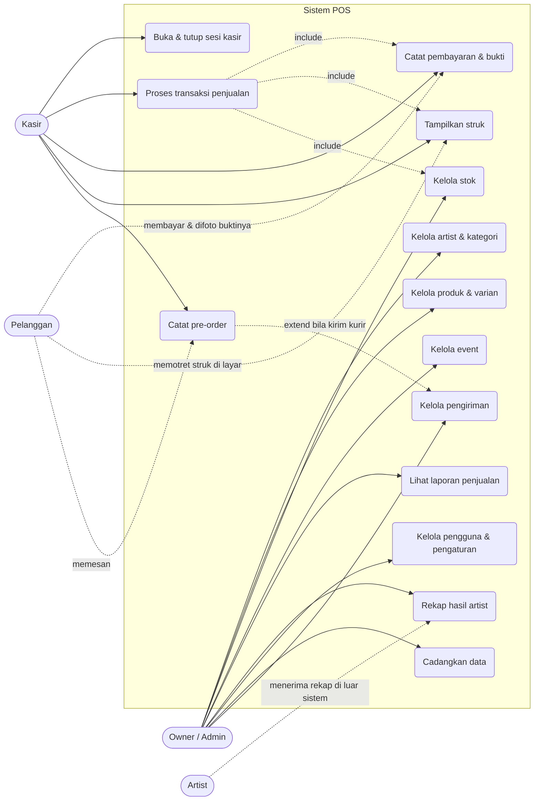

Catatan: pelanggan dan artist bukan pengguna sistem pada MVP. Keduanya digambarkan sebagai aktor eksternal untuk memperjelas batas sistem — artist menerima rekap melalui berkas yang dikirim manual, bukan lewat login.

---

## 2. Class diagram

Struktur entitas MVP beserta relasinya. Hanya atribut kunci yang ditampilkan; daftar kolom lengkap ada di berkas skema.

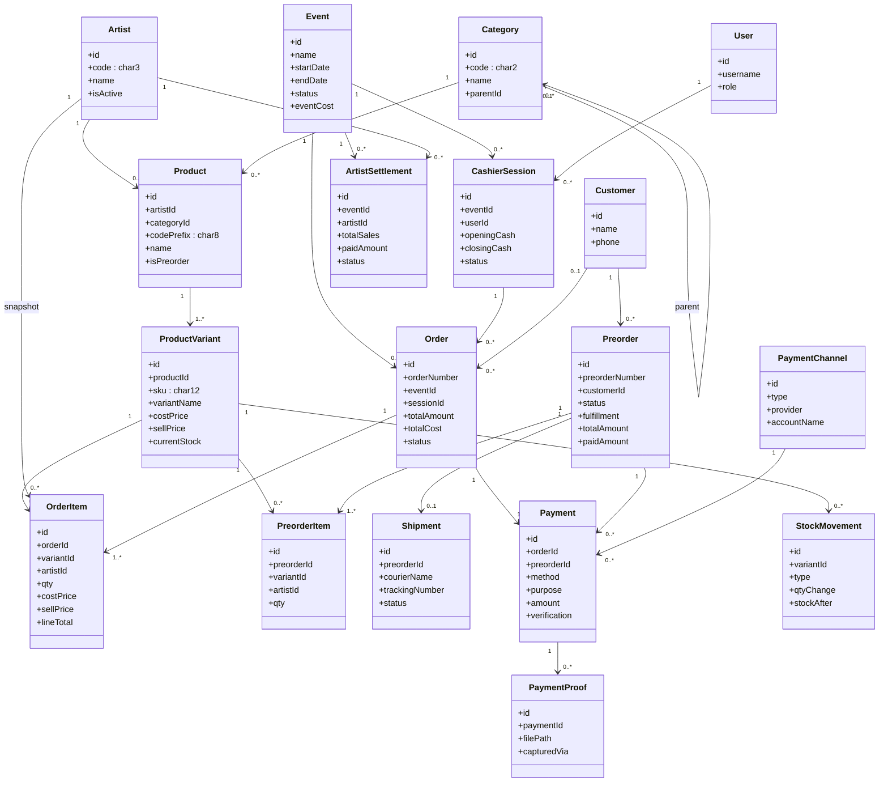

Dua hal yang sengaja terlihat dari diagram ini:

- `OrderItem` punya relasi langsung ke `Artist` meski sudah bisa ditelusuri lewat `ProductVariant → Product → Artist`. Ini snapshot yang disengaja agar rekap hasil artist kebal terhadap perubahan data master.
- `Payment` menempel ke `Order` atau ke `Preorder`, tidak pernah keduanya. Pre-order bisa punya beberapa pembayaran karena ada DP lalu pelunasan.

---

## 3. Sequence diagram — transaksi kasir

Alur transaksi dengan pembayaran non-tunai, termasuk aturan bukti bayar wajib.

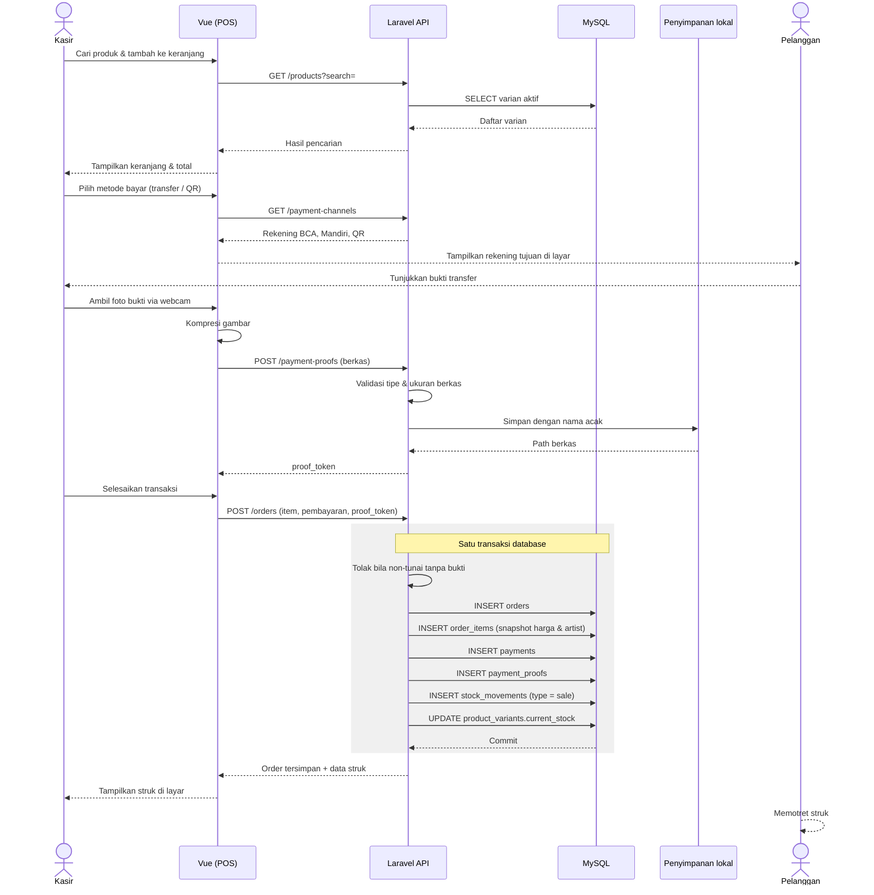

Bagian berkotak adalah satu transaksi database. Bila salah satu langkah gagal, seluruhnya dibatalkan — ini yang mencegah stok berkurang tanpa transaksi tercatat, atau sebaliknya.

---

## 4. Sequence diagram — pre-order sampai pengiriman

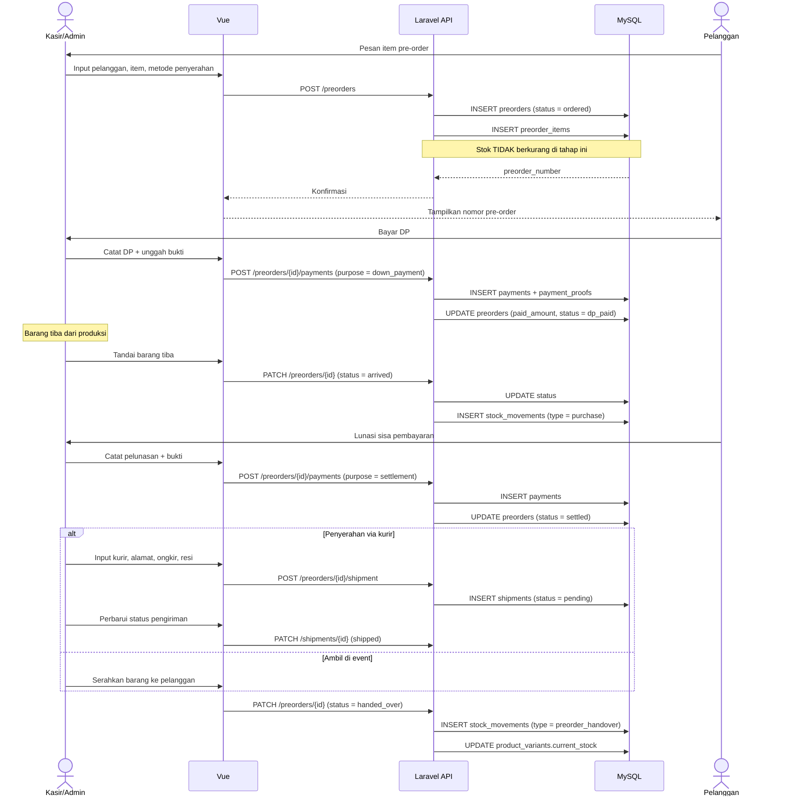

Titik paling rawan salah paham ada di sini: stok bertambah saat barang tiba, dan baru berkurang saat diserahkan. Kalau keduanya dilewat, stok sistem akan meleset dari stok fisik.

---

## 5. Activity diagram — alur kerja event

Dari persiapan sebelum event sampai rekap hasil artist setelahnya.

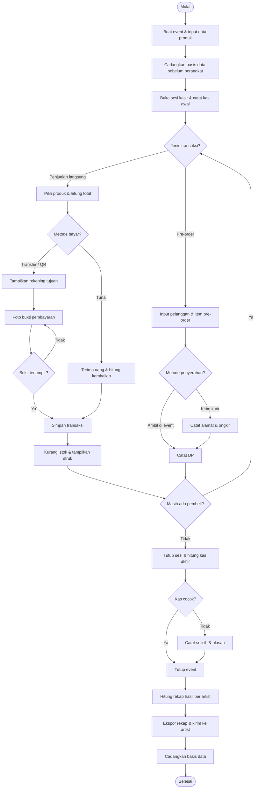

---

## 6. State machine diagram

### 6.1 Status pre-order

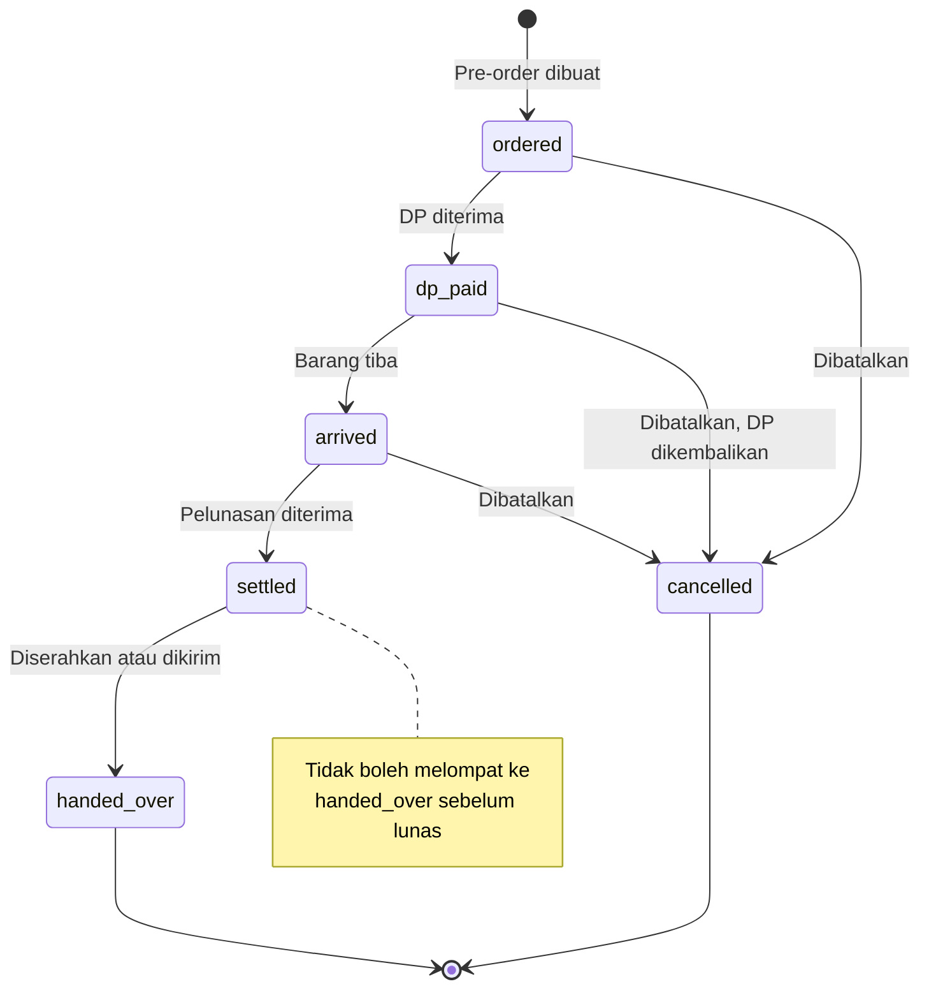

### 6.2 Status pembayaran

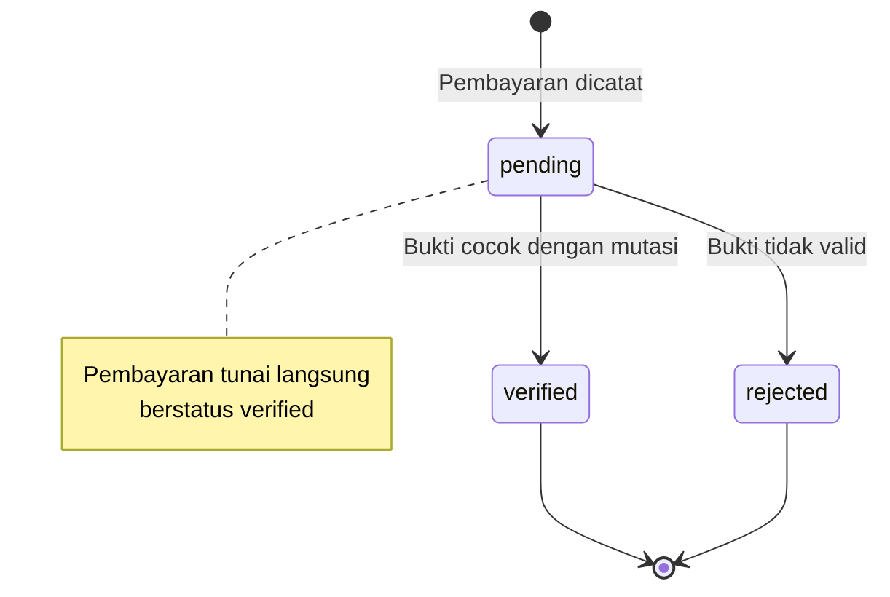

### 6.3 Status sesi kasir

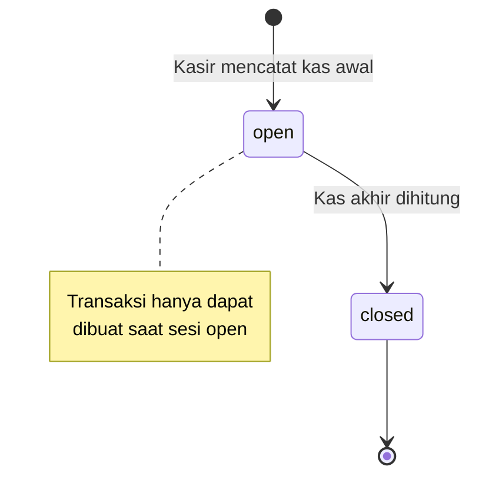

### 6.4 Status event

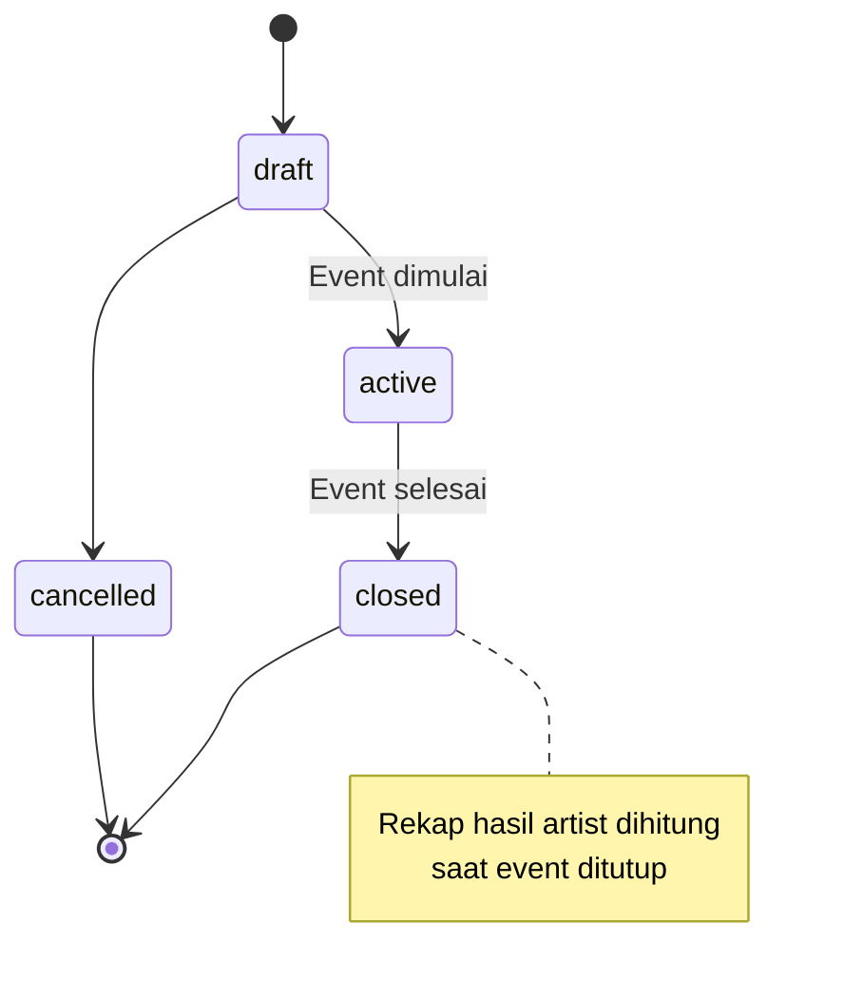

### 6.5 Status pengiriman

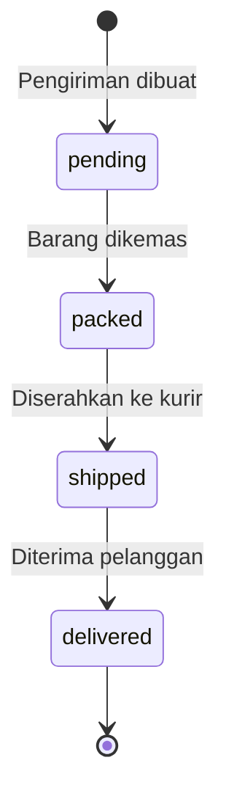

---

## 7. Deployment diagram

Seluruh komponen berjalan di satu laptop operasional.

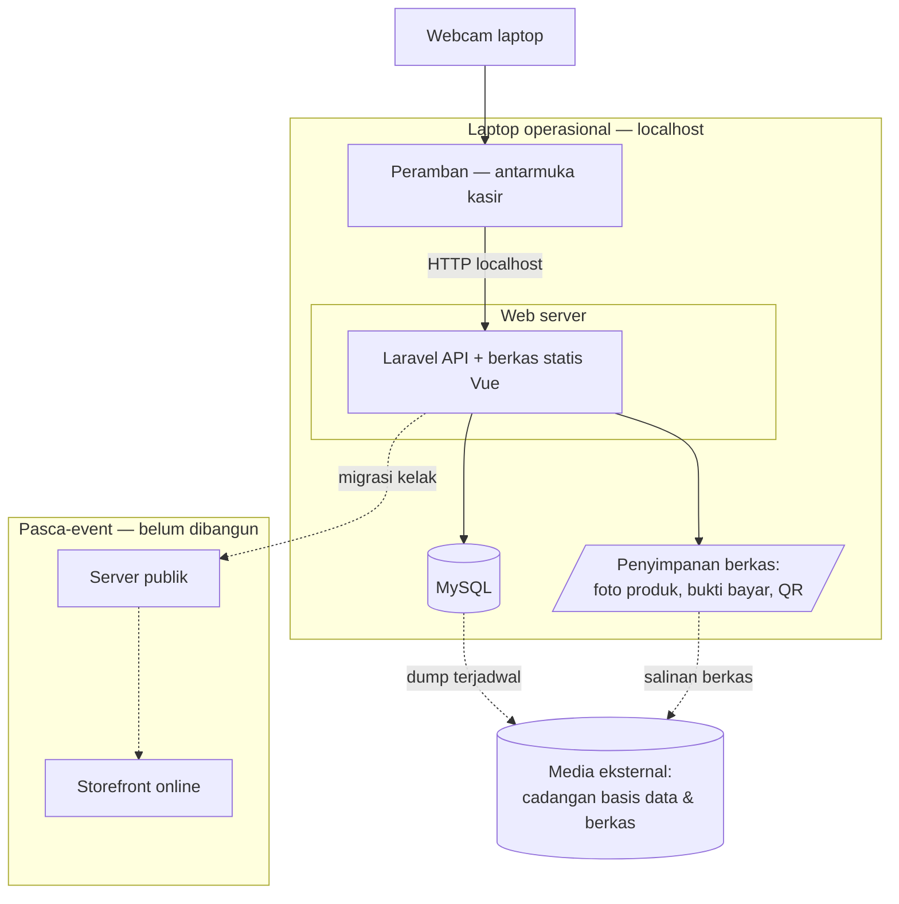

Tidak ada panah keluar ke internet pada blok utama. Inilah alasan kebutuhan offline terpenuhi tanpa lapisan sinkronisasi.

Panah putus-putus ke media eksternal adalah satu-satunya pengaman terhadap kerusakan perangkat. Bila panah itu tidak dijalankan rutin, seluruh data penjualan bergantung pada satu laptop.

---

## 8. Catatan implementasi

| Aturan | Alasan |
|---|---|
| Transaksi penjualan, pembayaran, bukti, dan pergerakan stok ditulis dalam satu transaksi database | Mencegah stok berkurang tanpa transaksi tercatat, atau sebaliknya |
| Validasi bukti bayar wajib ditegakkan di sisi server | Aturan di antarmuka saja dapat dilewati melalui permintaan API langsung |
| `stock_movements` bersifat append-only | Koreksi dilakukan dengan baris `adjustment` baru, bukan mengubah riwayat |
| Nomor transaksi dan pre-order dihasilkan server | Menghindari duplikasi bila antarmuka mengirim ulang permintaan |
| Status hanya berpindah sesuai state machine di bagian 6 | Lompatan status seperti `ordered` langsung ke `handed_over` harus ditolak API |

---

## 9. Gate lisensi Pro vs Master (v1.1)

Ditambahkan setelah keputusan produk: multi-artist tetap ada tapi bisa
dimatikan, dengan harga berbeda per tingkat. Bukan diagram baru — cukup
satu titik keputusan yang menyisip ke use case `uc1` (Kelola artist) di
bagian 1.

```mermaid
flowchart TD
  A([Admin klik "Tambah Artist"]) --> B{multi_artist_enabled?}
  B -->|Ya - Master| C[Buat artist baru, tanpa batas]
  B -->|Tidak - Pro| D{Sudah ada artist aktif?}
  D -->|Belum, instalasi baru| E[Buat sebagai artist bawaan]
  D -->|Sudah ada| F[Tolak 403: perlu upgrade ke Master]
```

Titik penegakan: `ArtistPolicy::create`, bukan di layer database. Skema
tidak berubah — `artists` tetap tabel biasa tanpa kolom atau constraint
tambahan untuk membedakan Pro/Master.

Konsekuensi pada diagram lain di dokumen ini: relasi `Artist → Product`
pada class diagram (bagian 2) dan snapshot `artist_id` di `OrderItem`
tetap sama persis untuk kedua tingkat harga — pada Pro, seluruh
`order_items` hanya menunjuk ke satu artist bawaan itu. Tidak ada
percabangan skema antara Pro dan Master, hanya percabangan di titik
pembuatan artist.
