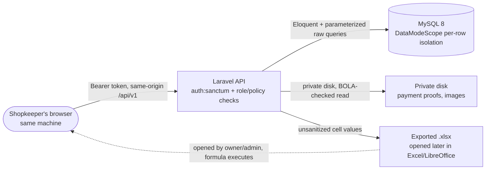

**CONFIDENTIAL** — documents control internals and unpatched findings; restrict distribution to engineering/security stakeholders until remediated.

# Security Review: BoothPOS (full application)

**Reviewer:** Claude Sonnet 5 (security-review skill)
**Date:** 2026-09-05
**Scope:** Whole application — Laravel 13 API (`app/`) + Vue 3 SPA (`resources/js/`), including the Docker dev-environment tooling added in feature 015 (`docker-compose.yml`, `docker/`).
**Method:** White-box code review against `owasp-checklist.md` (core) + `api-security-top10.md` (loaded — this app defines a server-side API via `routes/api.php`). LLM module not loaded — no LLM SDK usage found in the repo. CI/CD module not loaded as a separate pass — no pipeline config exists (`.github/workflows/`, `bitbucket-pipelines.yml` both absent); the new Dockerfiles were reviewed under core A05/A06 instead.

Three parallel focus passes (authn/authz; injection/uploads/business-logic; config/secrets/XSS/logging) plus one finding independently verified end-to-end by the reviewer beyond any single pass's scope (the discount/total-amount inconsistency below).

---

## Executive Summary

BoothPOS's security posture is solid for its actual deployment context (a one-time-license, single-machine, localhost-only POS app with no cloud tier — per `CLAUDE.md`'s own framing). Object-level authorization (BOLA), file-upload handling, and SQL-injection surfaces are all handled correctly and consistently — these are exactly the areas that most commonly fail in apps like this, and they don't here. No unauthenticated or public-network attack path was found.

The one finding worth real attention: **an authenticated user who can create an order can make a per-item discount silently disappear from the order's own header total** (`orders.total_amount`), while that same discount IS reflected in the per-line `order_items.line_total` figures that feed artist settlements and reports elsewhere in the app. This is a genuine business-logic/accounting-integrity bug (not a data-breach or remote-exploit issue) — it requires bypassing the UI (the frontend never sends a per-item discount at all) and authenticated API access, but any cashier-level account already has that. Recommend fixing before this ships to a second real store, since it's exactly the kind of financial-reconciliation bug that erodes trust in a consignment (multi-artist-settlement) business model.

Everything else is Medium-and-below: a real but moderate-impact Excel formula-injection gap on exports, and a handful of Low/Info hardening items (no security-headers middleware, CSRF resting solely on `SameSite=Lax`, no rate limiting beyond login).

| Severity | Count |
|----------|-------|
| 🔴 Critical | 0 |
| 🟠 High | 2 |
| 🟡 Medium | 1 |
| 🔵 Low | 4 |
| ⚪ Info | 6 |

**Recommendation:** 🟡 Ship with mitigations — fix the two High findings before the next store onboarding; the rest can be scheduled normally.

## Threat Model

### System summary

BoothPOS is a Laravel 13 API + Vue 3 SPA, both served from one machine over `localhost`, sold as a one-time license per store (event-based multi-artist merchandise booths). Roles: `owner`, `admin`, `cashier`, `inventory`. It handles: customer PII (name/phone/email, optional), payment proof images, product/pricing/stock data, and — because artists consign merchandise and are paid out via settlements computed from recorded sales — **financial data whose accuracy directly determines a third party's (the artist's) payout**. There is no cloud tier and no cross-store multi-tenancy; "production" is a shopkeeper's laptop at an event venue.

### Top threats (prioritized)

1. **A cashier-role insider** could exploit the discount/total-amount inconsistency (High finding #1 below) to make an artist's recorded settlement-attributed revenue diverge from what a customer was actually charged — a direct insider-fraud/skimming vector against the store's own consignment artists, not against BoothPOS's operator.
2. **Any authenticated user** (any of the 4 roles) could plant a formula-injection payload in a name/notes field that later executes when an owner/admin opens an exported report in Excel — a lower-privilege-to-higher-privilege attack via a shared export artifact.
3. **A network-adjacent attacker** (same LAN as the shop's laptop) gains little from the missing security headers / CORS defaults, since there's no cross-origin credentialed surface and no cross-site content to protect against clickjacking in practice today — flagged as defense-in-depth, not an active threat.
4. **The Docker dev-environment** (feature 015) is explicitly local-tooling-only and never deployed to a store machine — its exposed ports/CORS relaxation don't extend the app's real attack surface.

### Trust boundaries



Authentication happens once at the `browser → api` boundary (Sanctum Bearer token, `throttle:5,1` on login). Authorization is re-checked per-request via `auth:sanctum` + (FormRequest `authorize()` / inline `isOwnerOrAdmin()` / `canAccessMenu()` / Policy classes — four mechanisms in practice, not the three `CLAUDE.md` currently documents; see Info finding below). The `api → export` boundary is where the formula-injection finding lives: data crosses from "user input" to "another user's spreadsheet application" with no encoding.

---

## Findings

### 🟠 High

#### SEC-H1 — Per-item order discount is stored in `order_items.line_total` but never subtracted from `orders.total_amount` (accounting-integrity gap)
- **Status: ✅ Fixed (2026-09-05)** — `OrderService::create()` now accumulates `$subtotal` from post-item-discount `$lineTotal` values instead of the raw pre-discount price, so `orders.total_amount`/`orders.subtotal` are always consistent with `SUM(order_items.line_total)`. Covered by `test_per_item_discount_reduces_total_amount_and_matches_line_total` in `tests/Feature/OrderTest.php`.
- **Where:** `app/Services/OrderService.php:84-99`, `app/Http/Requests/StoreOrderRequest.php:22,28`
- **CWE:** CWE-840 (Business Logic Errors)
- **Description:** `StoreOrderRequest` accepts both an order-level `discount_amount` and a per-item `items[].discount_amount` (both validated only `numeric, min:0` — no upper bound, see SEC-H2). Inside `OrderService::create()`:
  ```php
  $discount = (float) ($itemInput['discount_amount'] ?? 0);
  $lineTotal = ((float) $variant->sell_price * $qty) - $discount;   // per-item discount applied HERE
  ...
  $subtotal += (float) $variant->sell_price * $qty;                  // accumulates RAW price, ignores $discount
  ...
  $orderDiscount = (float) ($data['discount_amount'] ?? 0);
  $totalAmount = $subtotal - $orderDiscount;                          // per-item $discount NEVER subtracted here
  ```
  `$lineTotal` (which becomes `order_items.line_total` — the figure `ReportController`'s `sales()`/`profit()`/artist-settlement queries and `SettlementService::recalculateForEvent()` all read to compute what an artist is owed) reflects the per-item discount. `$totalAmount` (the order's own header total, what `payments` must sum to, what appears on the receipt as "Total") does not. Whenever any `items[].discount_amount` is used, `orders.total_amount` no longer equals `SUM(order_items.line_total)` for that order — by exactly the sum of the per-item discounts applied.
- **Reachability:** The frontend (`resources/js/views/PosView.vue:187,228`) never sends `items[].discount_amount` at all — only `variant_id`/`qty`/`sku`/`sell_price`. This field is reachable ONLY via a direct API call (Bruno/Postman/curl) with a valid Sanctum token — i.e. requires an authenticated user (any role capable of `POST /orders`, which includes `cashier`, the lowest transactional role) to deliberately bypass the UI. Verified: zero test coverage of `items[].discount_amount` exists in `tests/Feature/OrderTest.php` (grep returned no matches), consistent with this being a live, untested code path.
- **Impact:** A cashier can record a lower `line_total` for a specific artist's item (reducing that artist's settlement-attributed revenue) while the order's `total_amount` — and therefore what `payments` must actually collect from the customer — stays based on the undiscounted price. This is a direct insider mechanism to under-report what's owed to a consigning artist without changing what the store actually collects from the customer, or conversely a data-integrity bug that makes `orders.total_amount` disagree with the sum of its own line items on every order that uses a per-item discount.
- **Recommendation:** Compute `$totalAmount` from the sum of per-line `$lineTotal` values (post-item-discount) instead of raw `$subtotal`, then subtract `$orderDiscount` on top of that — i.e. `$totalAmount = array_sum(line_totals) - $orderDiscount`. Add a test asserting `orders.total_amount === SUM(order_items.line_total) - orders.discount_amount` for an order using a per-item discount. Given the frontend never uses this field today, also consider whether `items[].discount_amount` should be removed entirely (dead/unused input surface) rather than fixed, if there's no real product need for per-item discounts distinct from the order-level one already exposed in the UI.

#### SEC-H2 — Discount amounts (order-level and per-item) have no upper bound, allowing a negative order total in principle
- **Status: ✅ Fixed (2026-09-05)** — `OrderService::create()` now throws a `ValidationException` (mapped to HTTP 409 per this app's convention) when a per-item `discount_amount` exceeds that line's value, or when the order-level `discount_amount` exceeds the (post-item-discount) subtotal — both checked application-side since they need the server-resolved variant price, not a static `StoreOrderRequest` rule. Covered by `test_per_item_discount_exceeding_line_value_is_rejected` and `test_order_level_discount_exceeding_subtotal_is_rejected` in `tests/Feature/OrderTest.php`. The optional defense-in-depth DB `CHECK` constraint mentioned below was NOT added (not required now that both entry points are validated server-side).
- **Where:** `app/Http/Requests/StoreOrderRequest.php:22,28` (`'sometimes', 'numeric', 'min:0'` — no `max:`)
- **CWE:** CWE-840, CWE-20 (Improper Input Validation)
- **Description:** Neither `discount_amount` (order-level) nor `items.*.discount_amount` is capped against the value it's discounting from. `PosCartPanel.vue:21` clamps the *displayed* total client-side (`Math.max(subtotal - discount, 0)`), but this is UX only — the server performs no equivalent clamp before persisting `orders.total_amount`/`order_items.line_total`.
- **Verified nuance (calibrating exploitability):** A large-enough discount drives `total_amount` negative, but `OrderService::create()`'s existing payment-sufficiency check (`paidAmount >= totalAmount`) and change-reconciliation check (`changeAmount > cashPaid + 0.01` throws) were traced through manually for this review and, for any realistic payment amount, a strongly negative `total_amount` produces a `changeAmount` large enough to fail the change check regardless of payment method — meaning the dramatic "give away merchandise for free with a huge fake discount" scenario is largely (though not provably in every edge case) blocked by those *existing, differently-motivated* checks as a side effect. The realistic exploitable range is a discount that pushes `total_amount` only slightly negative (e.g. a one-cent overshoot with an empty/omitted `payments` array), which is a data-integrity nuisance rather than a fraud windfall on its own — but combined with SEC-H1's line-total/total-amount divergence, the two together are the real risk, not this one in isolation.
- **Impact:** Low-to-moderate standalone; meaningfully compounds SEC-H1.
- **Recommendation:** Add explicit bounds: `discount_amount <= subtotal` at the order level, `items.*.discount_amount <= sell_price * qty` per line, checked in `OrderService::create()` (needs the resolved variant price, so an application-layer check, not just a FormRequest rule). Consider a defense-in-depth DB `CHECK (total_amount >= 0)` / `CHECK (line_total >= 0)` alongside the existing `qty > 0`/`payments.amount > 0` constraints in `2026_10_04_000003_create_orders_and_payments_tables.php`.

### 🟡 Medium

#### SEC-M1 — CSV/Excel formula injection on every export (`GenericArrayExport`, `SheetArrayExport`)
- **Where:** `app/Exports/GenericArrayExport.php:24-26` (and the `MultiSheetArrayExport`/`SheetArrayExport` siblings) — confirmed via direct read: `array()` returns row values completely unmodified, no cell-prefix escaping.
- **CWE:** CWE-1236 (Improper Neutralization of Formula Elements in a CSV File)
- **Description:** Any user-suppliable string that ends up in an exported row (artist/product/vendor/customer names, notes fields — none are restricted to alphanumeric server-side) is written verbatim into an `.xlsx` cell. A value like `=HYPERLINK("http://evil.example","click")` or a DDE-style payload, entered once as e.g. a vendor name, becomes a live formula in every future export that includes that row.
- **Impact:** Any authenticated user who can create a named record (the lowest-privilege roles that can create artists/products/customers/vendors, depending on the entity) can plant a payload that executes in the spreadsheet application of whichever higher-privileged user (typically owner/admin, per `canManageMasterData()`/report-export gating) later opens the export — client-side code execution or credential/data exfiltration on that user's machine, outside the app's own control entirely.
- **Recommendation:** Add one shared helper (called from both `GenericArrayExport::array()` and `SheetArrayExport`'s equivalent) that prefixes any string cell value starting with `=`, `+`, `-`, `@`, or a tab/CR character with a leading `'` (single quote) before writing — the standard, well-established CSV/Excel-injection mitigation. This is a single, small, shared fix point since both export classes already funnel through a common pattern.

### 🔵 Low

- `bootstrap/app.php` — no security-headers middleware at all (no CSP, `X-Content-Type-Options`, `X-Frame-Options`/`frame-ancestors`, `Referrer-Policy`, `Strict-Transport-Security`). Low severity given the single-machine/localhost deployment context, but a cheap defense-in-depth addition (CWE-1021, CWE-693).
- CSRF protection rests solely on `SESSION_SAME_SITE=lax` (`config/session.php`) — `$middleware->statefulApi()` (Sanctum's real CSRF-cookie flow) is never invoked in `bootstrap/app.php`. Not currently exploitable (modern browsers' default SameSite=Lax already blocks the classic cross-site vector), but it's a single config value away from silently losing all CSRF defense with no layered backup (CWE-352).
- No row/complexity guard on uploaded Excel imports beyond the 10MB file-size cap (`app/Http/Requests/ImportMasterDataRequest.php:12`) — a small, densely-styled/sparse `.xlsx` could still cause outsized memory/CPU use during parsing. Low impact since the import endpoint is already `canManageMasterData()`-gated (owner/admin/inventory only) — an authenticated-insider DoS at worst (CWE-400).
- No rate limiting on expensive operations beyond login (`throttle:5,1` on `/auth/login` only) — Excel export/import and report-generation endpoints have none. All are already role-gated, so this is defense-in-depth, not a live gap.

### ⚪ Info / Defense-in-depth

- `config/cors.php` is unpublished (Laravel's framework default applies: `allowed_origins: ['*']`, `supports_credentials: false`). Verified inert in practice — `supports_credentials: false` means no credential/Bearer token is ever attached cross-origin regardless of the wildcard, and the app's own `axios` client only calls same-origin relative URLs. Recommend publishing an explicit config for auditability, not urgency.
- `vite.config.js`'s `server.cors: true` (added in feature 015) is confirmed scoped to Vite's **dev server only** (`npm run dev` / the Docker `node` service) — never the production build Laravel actually serves. Already a deliberate, reviewed tradeoff from that feature's own execution; re-confirmed here as correctly scoped, not a new concern.
- The Docker Compose stack's exposed ports (`3306`, `8000`, `5173` bound to `0.0.0.0`) and its documented dev-only DB password (`boothpos_local_dev`) are explicitly local-development tooling per `specs/015-dockerize-dev-environment/research.md` — never deployed to a store machine. No action needed beyond what that feature already documents.
- `CLAUDE.md`'s own documentation of "Authorization is split across three mechanisms" is stale: the codebase actually uses at least four in practice (`FormRequest::authorize()`, inline `isOwnerOrAdmin()`, the newer `canAccessMenu()` used by `ReportController`/`PaymentChannelController`/`ActivityLogController`/`OrderController::void()`, and 11 Policy classes in `app/Policies/`, not the 6 named). This means real coverage is broader than documented — a docs-accuracy issue, not a security gap, but worth fixing so a future reviewer doesn't under-count real coverage.
- Dependency versions (Laravel 13.29.0, Sanctum 4.3.3, maatwebsite/excel 4.0.2, Vue 3.5, Vite 6, axios 1.7.9) were recorded but **no CVE is claimed against any of them** — per policy, no CVE ID is fabricated without verified knowledge. **Unverified — recommend running `composer audit` and `npm audit`** as a follow-up before relying on this review for dependency-CVE coverage.
- A stale comment in `PaymentChannelController.php` (~line 20) describes a `GET /payment-channels/{id}` endpoint for unmasked account numbers that doesn't actually exist in `routes/api.php` — actual behavior is more restrictive than documented, not a vulnerability, but worth a docs cleanup.

---

## Things That Looked Good

- **File uploads are solid across the board**: `PaymentProofController` and the shared `ImageUploadService` both re-check real file content (not just declared MIME/extension), cap size, generate random UUID filenames (no path traversal, no user-controlled filename), and store on a private disk. `PaymentProofController::show()` is textbook BOLA-safe (`uploaded_by === $user->id || isOwnerOrAdmin()`), with its own docblock naming BOLA explicitly.
- **No SQL injection surface found**: every hand-rolled `DB::table`/`selectRaw`/raw-join in `ReportController` (flagged by `CLAUDE.md` itself as a place to check) builds its raw SQL fragments from a fixed, hardcoded whitelist (a `match($groupBy)` with 5 known arms + safe default, or a private class constant) — the request's actual string value is never interpolated into SQL.
- **Stock mutations are race-safe**: `StockService::applyMovement()` wraps every write in `DB::transaction()` + `lockForUpdate()`; `OrderService::create()` locks the `ProductVariant` row before computing line totals, closing the double-sell TOCTOU window.
- **Sell/cost price integrity holds**: `sell_price`/`cost_price` are always read from the DB-resident `ProductVariant`, never from client input — only the *discount* on top of that price is unclamped (SEC-H1/H2).
- **Master-data Excel import is properly all-or-nothing**, matching its own documented guarantee (`MasterDataImportService::apply()` wraps the entire multi-sheet write in one transaction).
- **Auth architecture sidesteps CSRF by design**: the app uses Sanctum personal-access tokens (Bearer), not stateful cookie-session SPA auth — confirmed `EnsureFrontendRequestsAreStateful` is correctly absent. The Low CSRF finding above is about the theoretical single-point-of-failure in `SESSION_SAME_SITE`, not an active gap in the auth model itself.
- **Zero `v-html` usage** anywhere in `resources/js/` — Vue's default auto-escaping is used throughout; no direct raw-HTML-injection vector for stored XSS via user-controlled fields.
- **Token storage** (`resources/js/utils/storage.js`) deliberately uses `sessionStorage`, not `localStorage`, with an explicit documented rationale — a considered decision, not an oversight.
- **`storage/logs` is not web-accessible** — `public/storage` only symlinks to `storage/app/public`, never to `storage/logs`.
- Every non-login route sits behind `auth:sanctum`; login has `throttle:5,1`; `PaymentChannelController::index()` already masks account numbers for non-privileged roles (a deliberate, self-documented mitigation, not an accident).

## Out of Scope

- Penetration testing of the running application — this is a white-box code review only.
- Compliance mapping (SOC2/ISO/HIPAA/PDP) — separate work; note this org's own instructions already require UU PDP 27/2022 + ISO 27001/27701 handling for any customer/employee PII, which is a policy-layer obligation this review doesn't re-derive.
- The Android installer (`android/`, feature 008) — a separate native-shell packaging concern, not reviewed in this pass.
- Exhaustive review of all 19 `ActivityLogger` call sites for PII-in-log-message leakage — one caller (`UserController`) was spot-checked and found clean; the remaining 18 were not exhaustively checked in the time available.
- Formal CVE/dependency-vulnerability scanning — recommend `composer audit`/`npm audit` as a follow-up (see Info findings).

## Suggested Follow-ups

- [x] Fix SEC-H1 (total_amount must reflect per-item discounts) and SEC-H2 (upper-bound validation on discounts) before onboarding a second real store — these compound into a real artist-settlement integrity risk for this consignment business model. **Fixed 2026-09-05** — see Status notes on each finding above; `php artisan test` (427/427) passes.
- [ ] Add the shared formula-injection-safe cell helper for SEC-M1 and apply it to both export classes.
- [ ] Run `composer audit` and `npm audit` and triage any real findings (this review did not fabricate or assume CVEs).
- [ ] Update `CLAUDE.md`'s authorization-mechanisms paragraph to reflect the actual 4-mechanism/11-policy reality found during this review.
- [ ] Consider a lightweight security-headers middleware and explicit `config/cors.php` as a batched, low-priority hardening sweep (per `severity-cvss.md`'s own guidance: a pile of Lows ignored becomes a Medium eventually).
