**Klasifikasi: INTERNAL**

# Diagram UML — BoothPOS

*Sistem POS event-based multi-artist untuk toko merchandise*

| Field | Isi |
|---|---|
| Versi | v1.4 |
| Tanggal | 2 September 2026 |
| Cakupan | MVP Oktober 2026, termasuk pre-order dan pengiriman kurir, ditambah kapabilitas pasca-MVP: log aktivitas (F13.4), Settings admin CRUD, ekspor/impor Excel master data, modul Vendor/Bahan Baku/BOM, dan manajemen pengguna & peran kustom (`001-user-store-settings`) |
| Acuan | PRD v1.6, `schema-pos-mvp.sql`, `openapi-pos-mvp.yaml` |

**Addendum v1.3** — dokumen ini sebelumnya berhenti di commit pertama (`31c588c`) dan tidak mengikuti seluruh pekerjaan backend/frontend yang menyusul. Bagian 3 (sequence transaksi kasir) diperbaiki agar bukti pembayaran dan log aktivitas tergambar konsisten dengan kode; bagian 4 (pre-order) diperbaiki karena diagram lama tidak menunjukkan bug `customer`/`payments`/`shipment` yang hilang dari response (sudah diperbaiki di kode, lihat catatan pada bagian tersebut); bagian 9 diperluas dengan Settings admin CRUD; dan bagian 10–13 baru ditambahkan untuk log aktivitas, impor/ekspor Excel, Vendor/Bahan Baku/BOM, dan kanal pembayaran QR. Bagian 1–2 (use case dan class diagram) diperluas secukupnya untuk mencakup aktor/entitas baru tanpa menghapus struktur MVP asli.

**Addendum v1.4** — bagian 14 baru ditambahkan untuk fitur `001-user-store-settings`: model otorisasi `Role`/`menu_keys` dinamis yang menggantikan enum `role` 4-nilai tetap, CRUD pengguna & peran kustom, dan profil toko lengkap di struk. Bagian 1–2, 9, dan 11 tidak digambar ulang untuk perubahan ini — perubahan skema `users`/`roles` dan sheet impor baru cukup dijelaskan naratif di bagian 14 sendiri, karena diagram bagian 2 sudah cukup padat dan `Role`/`User` bukan bagian dari struktur transaksi kasir inti yang digambarkannya.

Diagram ditulis dalam sintaks Mermaid agar ikut terkontrol versi bersama kode. Dapat dirender di GitHub, ekstensi Mermaid pada VS Code, atau mermaid.live.

---

## 1. Use case diagram

Menggambarkan siapa melakukan apa terhadap sistem pada cakupan MVP.

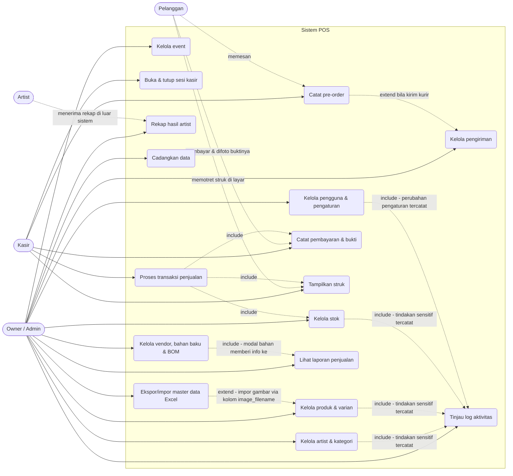
```mermaid
flowchart LR
  owner([Owner / Admin])
  cashier([Kasir])
  customer([Pelanggan])
  artist([Artist])

  subgraph SYS[Sistem POS]
    uc1(Kelola artist & kategori)
    uc2(Kelola produk & varian)
    uc3(Kelola stok)
    uc4(Kelola event)
    uc5(Buka & tutup sesi kasir)
    uc6(Proses transaksi penjualan)
    uc7(Catat pembayaran & bukti)
    uc8(Tampilkan struk)
    uc9(Catat pre-order)
    uc10(Kelola pengiriman)
    uc11(Lihat laporan penjualan)
    uc12(Rekap hasil artist)
    uc13(Kelola pengguna & pengaturan)
    uc14(Cadangkan data)
    uc15(Tinjau log aktivitas)
    uc16(Ekspor/impor master data Excel)
    uc17(Kelola vendor, bahan baku & BOM)
  end

  owner --> uc1
  owner --> uc2
  owner --> uc3
  owner --> uc4
  owner --> uc11
  owner --> uc12
  owner --> uc13
  owner --> uc14
  owner --> uc10
  owner --> uc15
  owner --> uc16
  owner --> uc17

  cashier --> uc5
  cashier --> uc6
  cashier --> uc7
  cashier --> uc8
  cashier --> uc9

  customer -.membayar & difoto buktinya.-> uc7
  customer -.memotret struk di layar.-> uc8
  customer -.memesan.-> uc9
  artist -.menerima rekap di luar sistem.-> uc12

  uc6 -.include.-> uc7
  uc6 -.include.-> uc8
  uc6 -.include.-> uc3
  uc9 -.extend bila kirim kurir.-> uc10
  uc1 -.include - tindakan sensitif tercatat.-> uc15
  uc2 -.include - tindakan sensitif tercatat.-> uc15
  uc3 -.include - tindakan sensitif tercatat.-> uc15
  uc13 -.include - perubahan pengaturan tercatat.-> uc15
  uc16 -.extend - impor gambar via kolom image_filename.-> uc2
  uc17 -.include - modal bahan memberi info ke.-> uc11
```

Catatan: pelanggan dan artist bukan pengguna sistem pada MVP. Keduanya digambarkan sebagai aktor eksternal untuk memperjelas batas sistem — artist menerima rekap melalui berkas yang dikirim manual, bukan lewat login.

**uc13 diperjelas (v1.3)** — "Kelola pengguna & pengaturan" sebelumnya digambar sebagai satu use case generik tanpa endpoint nyata di baliknya. Sejak `GET/PUT /settings` dan `GET /settings/features` ada, ini mencakup: (1) mengubah pengaturan toko (nama, kontak, format struk) lewat `PUT /settings` bentuk bulk; (2) upgrade lisensi Pro → Master dengan mengubah key `multi_artist_enabled` lewat endpoint yang sama — bukan lagi lewat Tinker/seeder langsung ke database seperti sebelumnya. Setiap key yang berubah menulis satu baris log aktivitas (uc15) di dalam transaksi yang sama.

uc15–uc17 adalah kapabilitas pasca-MVP yang tidak ada di versi awal dokumen ini — lihat bagian 10–13 untuk detail.

---

## 2. Class diagram

Struktur entitas MVP beserta relasinya. Hanya atribut kunci yang ditampilkan; daftar kolom lengkap ada di berkas skema.

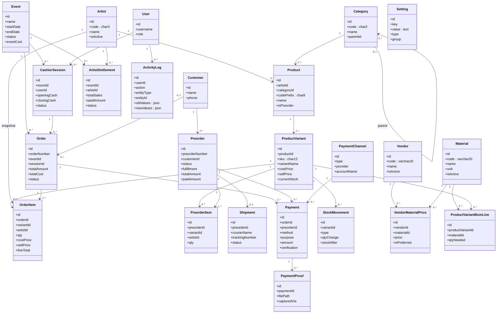
```mermaid
classDiagram
  class Artist {
    +id
    +code : char3
    +name
    +isActive
  }
  class Category {
    +id
    +code : char2
    +name
    +parentId
  }
  class Product {
    +id
    +artistId
    +categoryId
    +codePrefix : char8
    +name
    +isPreorder
  }
  class ProductVariant {
    +id
    +productId
    +sku : char12
    +variantName
    +costPrice
    +sellPrice
    +currentStock
  }
  class Event {
    +id
    +name
    +startDate
    +endDate
    +status
    +eventCost
  }
  class CashierSession {
    +id
    +eventId
    +userId
    +openingCash
    +closingCash
    +status
  }
  class Order {
    +id
    +orderNumber
    +eventId
    +sessionId
    +totalAmount
    +totalCost
    +status
  }
  class OrderItem {
    +id
    +orderId
    +variantId
    +artistId
    +qty
    +costPrice
    +sellPrice
    +lineTotal
  }
  class Preorder {
    +id
    +preorderNumber
    +customerId
    +status
    +fulfillment
    +totalAmount
    +paidAmount
  }
  class PreorderItem {
    +id
    +preorderId
    +variantId
    +artistId
    +qty
  }
  class Shipment {
    +id
    +preorderId
    +courierName
    +trackingNumber
    +status
  }
  class Payment {
    +id
    +orderId
    +preorderId
    +method
    +purpose
    +amount
    +verification
  }
  class PaymentProof {
    +id
    +paymentId
    +filePath
    +capturedVia
  }
  class PaymentChannel {
    +id
    +type
    +provider
    +accountName
  }
  class StockMovement {
    +id
    +variantId
    +type
    +qtyChange
    +stockAfter
  }
  class Customer {
    +id
    +name
    +phone
  }
  class ArtistSettlement {
    +id
    +eventId
    +artistId
    +totalSales
    +paidAmount
    +status
  }
  class User {
    +id
    +username
    +role
  }
  class Setting {
    +id
    +key
    +value : text
    +type
    +group
  }
  class ActivityLog {
    +id
    +userId
    +action
    +entityType
    +entityId
    +oldValues : json
    +newValues : json
  }
  class Vendor {
    +id
    +code : varchar20
    +name
    +isActive
  }
  class Material {
    +id
    +code : varchar20
    +name
    +unit
    +isActive
  }
  class VendorMaterialPrice {
    +id
    +vendorId
    +materialId
    +price
    +isPreferred
  }
  class ProductVariantBomLine {
    +id
    +productVariantId
    +materialId
    +qtyNeeded
  }

  Artist "1" --> "0..*" Product
  Category "1" --> "0..*" Product
  Category "0..1" --> "0..*" Category : parent
  Product "1" --> "1..*" ProductVariant
  ProductVariant "1" --> "0..*" StockMovement
  ProductVariant "1" --> "0..*" OrderItem
  ProductVariant "1" --> "0..*" PreorderItem
  Event "1" --> "0..*" CashierSession
  Event "1" --> "0..*" Order
  Event "1" --> "0..*" ArtistSettlement
  Artist "1" --> "0..*" ArtistSettlement
  Artist "1" --> "0..*" OrderItem : snapshot
  User "1" --> "0..*" CashierSession
  CashierSession "1" --> "0..*" Order
  Customer "0..1" --> "0..*" Order
  Customer "1" --> "0..*" Preorder
  Order "1" --> "1..*" OrderItem
  Order "1" --> "1..*" Payment
  Preorder "1" --> "1..*" PreorderItem
  Preorder "1" --> "0..*" Payment
  Preorder "1" --> "0..1" Shipment
  Payment "1" --> "0..*" PaymentProof
  PaymentChannel "1" --> "0..*" Payment
  Vendor "1" --> "0..*" VendorMaterialPrice
  Material "1" --> "0..*" VendorMaterialPrice
  Material "1" --> "0..*" ProductVariantBomLine
  ProductVariant "1" --> "0..*" ProductVariantBomLine
  User "1" --> "0..*" ActivityLog
```

Dua hal yang sengaja terlihat dari diagram ini:

- `OrderItem` punya relasi langsung ke `Artist` meski sudah bisa ditelusuri lewat `ProductVariant → Product → Artist`. Ini snapshot yang disengaja agar rekap hasil artist kebal terhadap perubahan data master.
- `Payment` menempel ke `Order` atau ke `Preorder`, tidak pernah keduanya. Pre-order bisa punya beberapa pembayaran karena ada DP lalu pelunasan.

Entitas pasca-MVP (v1.3), semuanya digantung longgar, bukan bagian struktur inti kasir:

- `Setting` tidak digambar dengan relasi eksplisit ke entitas lain — ia tabel key-value generik (`store_name`, `multi_artist_enabled`, dst). `ActivityLog` menunjuk balik ke `User` yang melakukan aksi, tapi TIDAK punya FK terstruktur ke entitas yang diubahnya (`entity_type`/`entity_id` polimorfik, bukan relasi Eloquent) — karena satu tabel log harus bisa mencatat aksi terhadap entitas apa pun (Artist, Category, Product, Setting, Vendor, Material, ProductVariantBomLine, dst) tanpa migrasi baru tiap kali entitas baru ditambahkan.
- `VendorMaterialPrice` adalah tabel pivot beratribut (unique pada pasangan `vendor_id`+`material_id`, plus `price` dan `is_preferred`) — bukan many-to-many polos. `ProductVariantBomLine` sama polanya untuk `ProductVariant`+`Material` (unique pada pasangan, plus `qty_needed`).
- BOM diikat ke `ProductVariant`, bukan ke `Product` induk — lihat bagian 12 untuk alasannya.

---

## 3. Sequence diagram — transaksi kasir

Alur transaksi dengan pembayaran non-tunai, termasuk aturan bukti bayar wajib.

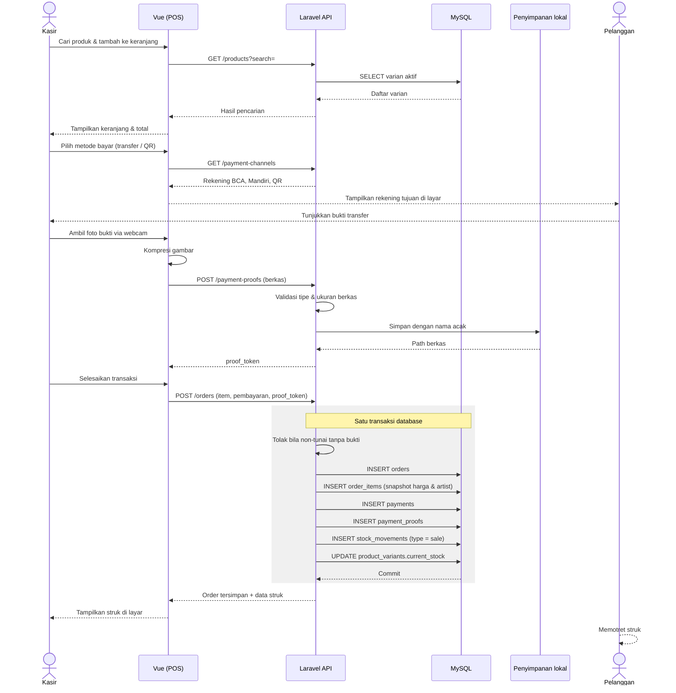
```mermaid
sequenceDiagram
  actor K as Kasir
  participant UI as Vue (POS)
  participant API as Laravel API
  participant DB as MySQL
  participant FS as Penyimpanan lokal
  actor P as Pelanggan

  K->>UI: Cari produk & tambah ke keranjang
  UI->>API: GET /products?search=
  API->>DB: SELECT varian aktif
  DB-->>API: Daftar varian
  API-->>UI: Hasil pencarian
  UI-->>K: Tampilkan keranjang & total

  K->>UI: Pilih metode bayar (transfer / QR)
  UI->>API: GET /payment-channels
  API-->>UI: Rekening BCA, Mandiri, QR
  UI-->>P: Tampilkan rekening tujuan di layar
  P-->>K: Tunjukkan bukti transfer

  K->>UI: Ambil foto bukti via webcam
  UI->>UI: Kompresi gambar
  UI->>API: POST /payment-proofs (berkas)
  API->>API: Validasi tipe & ukuran berkas
  API->>FS: Simpan dengan nama acak
  FS-->>API: Path berkas
  API-->>UI: proof_token

  K->>UI: Selesaikan transaksi
  UI->>API: POST /orders (item, pembayaran, proof_token)

  rect rgba(128,128,128,0.12)
    note over API,DB: Satu transaksi database
    API->>API: Tolak bila non-tunai tanpa bukti
    API->>DB: INSERT orders
    API->>DB: INSERT order_items (snapshot harga & artist)
    API->>DB: INSERT payments
    API->>DB: INSERT payment_proofs
    API->>DB: INSERT stock_movements (type = sale)
    API->>DB: UPDATE product_variants.current_stock
    DB-->>API: Commit
  end

  API-->>UI: Order tersimpan + data struk
  UI-->>K: Tampilkan struk di layar
  P-->>P: Memotret struk
```

Bagian berkotak adalah satu transaksi database. Bila salah satu langkah gagal, seluruhnya dibatalkan — ini yang mencegah stok berkurang tanpa transaksi tercatat, atau sebaliknya.

**Catatan v1.3 — transaksi penjualan biasa TIDAK menulis log aktivitas.** `POST /orders` bukan tindakan sensitif menurut F13.4 (ia sudah punya jejaknya sendiri lewat `orders`/`order_items`/`stock_movements`). Yang menulis `ActivityLog` adalah tindakan di *luar* alur ini: `POST /orders/{id}/void` (hapus/pembatalan), `POST /stock/adjustments` (penyesuaian stok manual), `PUT /variants/{id}` saat `cost_price`/`sell_price` berubah, `PUT /settings`, dan create/delete pada Artist/Category/Product/Vendor/Material/BOM. Polanya sama di semua titik itu: `ActivityLogger::log()` dipanggil di DALAM `DB::transaction()` yang sama dengan mutasinya, sehingga rollback pada mutasi juga membatalkan baris lognya — tidak pernah ada log yang mengklaim sebuah aksi terjadi padahal transaksinya gagal. Lihat bagian 10 untuk detail lengkap flow ini.

---

## 4. Sequence diagram — pre-order sampai pengiriman

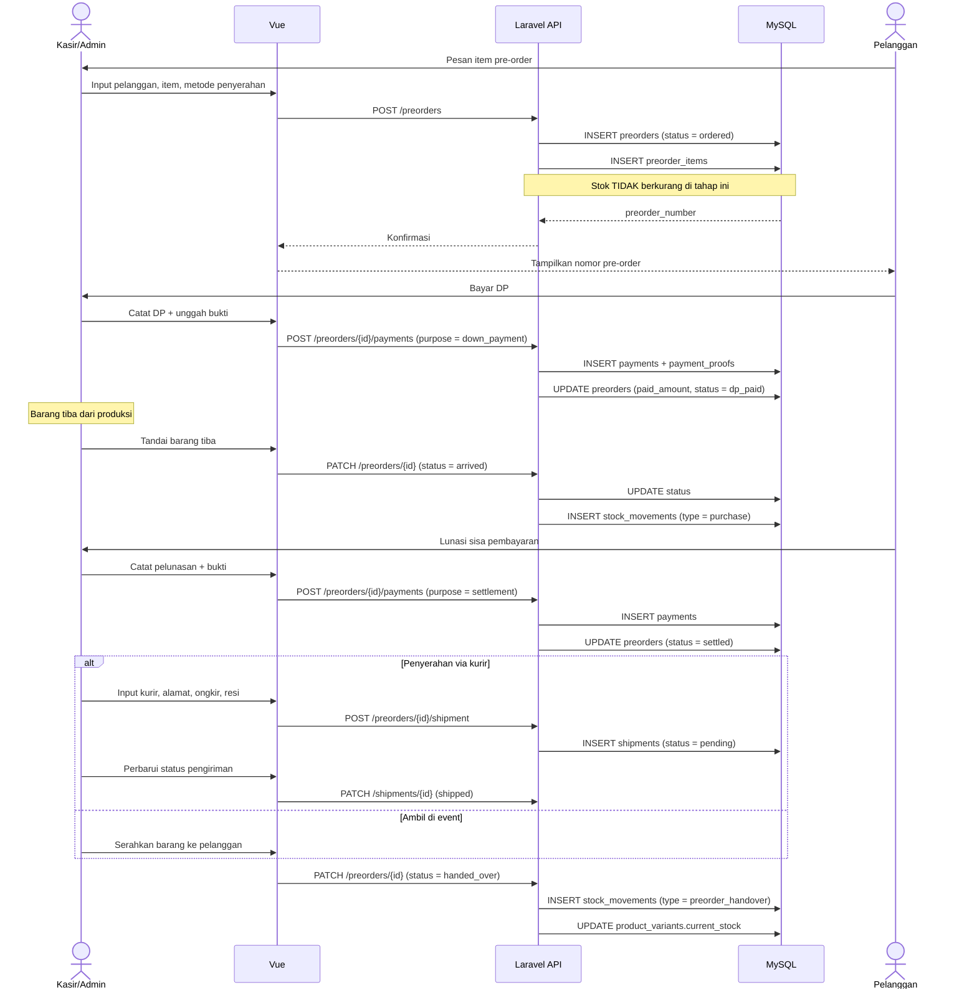
```mermaid
sequenceDiagram
  actor K as Kasir/Admin
  participant UI as Vue
  participant API as Laravel API
  participant DB as MySQL
  actor P as Pelanggan

  P->>K: Pesan item pre-order
  K->>UI: Input pelanggan, item, metode penyerahan
  UI->>API: POST /preorders
  API->>DB: INSERT preorders (status = ordered)
  API->>DB: INSERT preorder_items
  note over API,DB: Stok TIDAK berkurang di tahap ini
  DB-->>API: preorder_number
  API-->>UI: Konfirmasi
  UI-->>P: Tampilkan nomor pre-order

  P->>K: Bayar DP
  K->>UI: Catat DP + unggah bukti
  UI->>API: POST /preorders/{id}/payments (purpose = down_payment)
  API->>DB: INSERT payments + payment_proofs
  API->>DB: UPDATE preorders (paid_amount, status = dp_paid)

  note over K: Barang tiba dari produksi
  K->>UI: Tandai barang tiba
  UI->>API: PATCH /preorders/{id} (status = arrived)
  API->>DB: UPDATE status
  API->>DB: INSERT stock_movements (type = purchase)

  P->>K: Lunasi sisa pembayaran
  K->>UI: Catat pelunasan + bukti
  UI->>API: POST /preorders/{id}/payments (purpose = settlement)
  API->>DB: INSERT payments
  API->>DB: UPDATE preorders (status = settled)

  alt Penyerahan via kurir
    K->>UI: Input kurir, alamat, ongkir, resi
    UI->>API: POST /preorders/{id}/shipment
    API->>DB: INSERT shipments (status = pending)
    K->>UI: Perbarui status pengiriman
    UI->>API: PATCH /shipments/{id} (shipped)
  else Ambil di event
    K->>UI: Serahkan barang ke pelanggan
  end

  UI->>API: PATCH /preorders/{id} (status = handed_over)
  API->>DB: INSERT stock_movements (type = preorder_handover)
  API->>DB: UPDATE product_variants.current_stock
```

Titik paling rawan salah paham ada di sini: stok bertambah saat barang tiba, dan baru berkurang saat diserahkan. Kalau keduanya dilewat, stok sistem akan meleset dari stok fisik.

**Catatan v1.3 — bug yang ditemukan & diperbaiki pada `GET /preorders/{id}` (dan implisit pada setiap `PATCH` di atas yang mengembalikan body pre-order).** `PreorderController` memakai gaya `present()` hand-rolled yang menggerbang setiap relasi dengan `relationLoaded()` — bila service tidak memuat relasi lebih dulu, field itu diam-diam LENYAP dari response, bukan error. Sebelum diperbaiki, `customer`, `payments`, dan `shipment` hilang dari respons karena pemanggil lupa `load()`/`fresh()` relasi tersebut. Diagram di atas mengasumsikan versi yang sudah diperbaiki: setiap endpoint yang mengembalikan `Preorder` (`GET /preorders/{id}`, dan hasil dari `PATCH .../status`, `POST .../payments`, `POST .../shipment`) memuat `preorder->load(['items', 'payments', 'shipment', 'customer'])` sebelum di-`present()`, sehingga keempatnya SELALU tampil (bernilai `null`/array kosong bila memang belum ada, bukan hilang dari JSON). Siapa pun yang menambah relasi baru ke `present()` wajib memverifikasi `load()`-nya ikut diperbarui di titik yang sama — pola ini sengaja gagal senyap, tidak gagal keras.

---

## 5. Activity diagram — alur kerja event

Dari persiapan sebelum event sampai rekap hasil artist setelahnya.

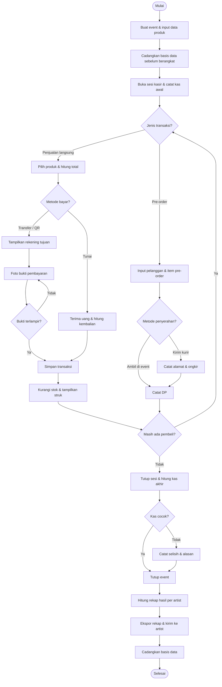
```mermaid
flowchart TD
  A([Mulai]) --> B[Buat event & input data produk]
  B --> C[Cadangkan basis data sebelum berangkat]
  C --> D[Buka sesi kasir & catat kas awal]
  D --> E{Jenis transaksi?}

  E -->|Penjualan langsung| F[Pilih produk & hitung total]
  E -->|Pre-order| G[Input pelanggan & item pre-order]

  F --> H{Metode bayar?}
  H -->|Tunai| I[Terima uang & hitung kembalian]
  H -->|Transfer / QR| J[Tampilkan rekening tujuan]
  J --> K[Foto bukti pembayaran]
  K --> L{Bukti terlampir?}
  L -->|Tidak| K
  L -->|Ya| M[Simpan transaksi]
  I --> M
  M --> N[Kurangi stok & tampilkan struk]
  N --> O{Masih ada pembeli?}

  G --> P{Metode penyerahan?}
  P -->|Ambil di event| Q[Catat DP]
  P -->|Kirim kurir| R[Catat alamat & ongkir]
  R --> Q
  Q --> O

  O -->|Ya| E
  O -->|Tidak| S[Tutup sesi & hitung kas akhir]
  S --> T{Kas cocok?}
  T -->|Tidak| U[Catat selisih & alasan]
  T -->|Ya| V[Tutup event]
  U --> V
  V --> W[Hitung rekap hasil per artist]
  W --> X[Ekspor rekap & kirim ke artist]
  X --> Y[Cadangkan basis data]
  Y --> Z([Selesai])
```

---

## 6. State machine diagram

### 6.1 Status pre-order

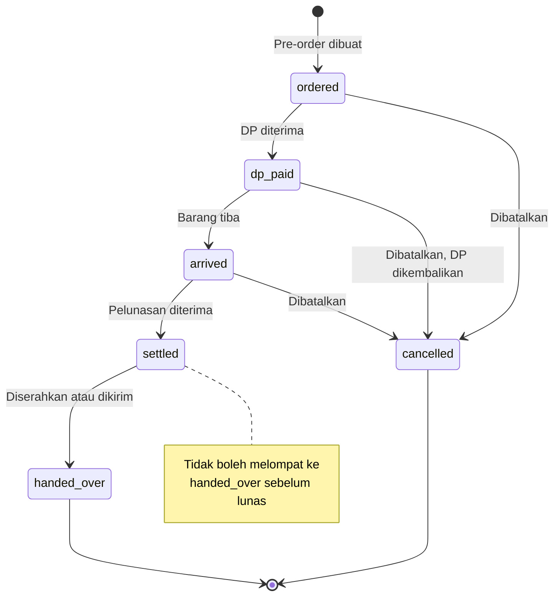
```mermaid
stateDiagram-v2
  [*] --> ordered : Pre-order dibuat
  ordered --> dp_paid : DP diterima
  ordered --> cancelled : Dibatalkan
  dp_paid --> arrived : Barang tiba
  dp_paid --> cancelled : Dibatalkan, DP dikembalikan
  arrived --> settled : Pelunasan diterima
  arrived --> cancelled : Dibatalkan
  settled --> handed_over : Diserahkan atau dikirim
  handed_over --> [*]
  cancelled --> [*]

  note right of settled
    Tidak boleh melompat ke
    handed_over sebelum lunas
  end note
```

### 6.2 Status pembayaran

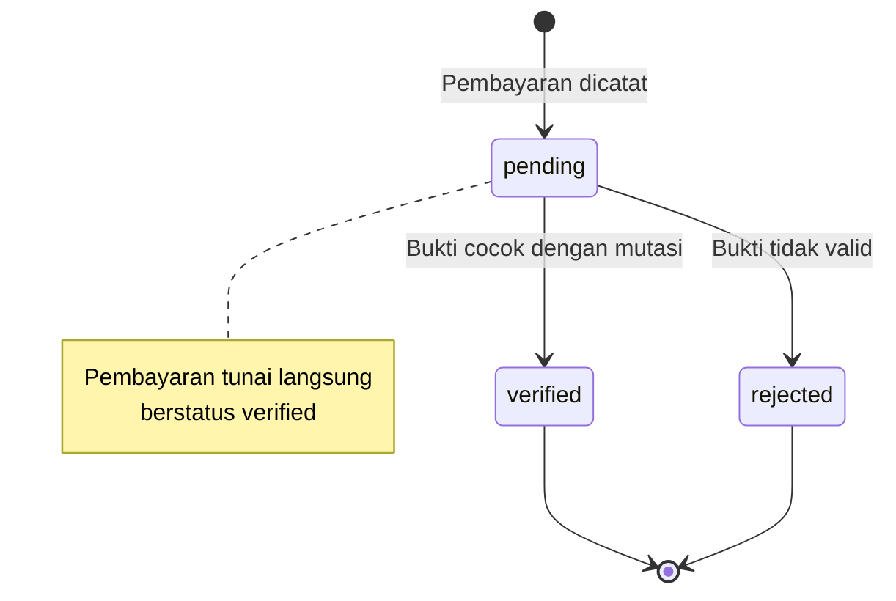
```mermaid
stateDiagram-v2
  [*] --> pending : Pembayaran dicatat
  pending --> verified : Bukti cocok dengan mutasi
  pending --> rejected : Bukti tidak valid
  verified --> [*]
  rejected --> [*]

  note right of pending
    Pembayaran tunai langsung
    berstatus verified
  end note
```

### 6.3 Status sesi kasir

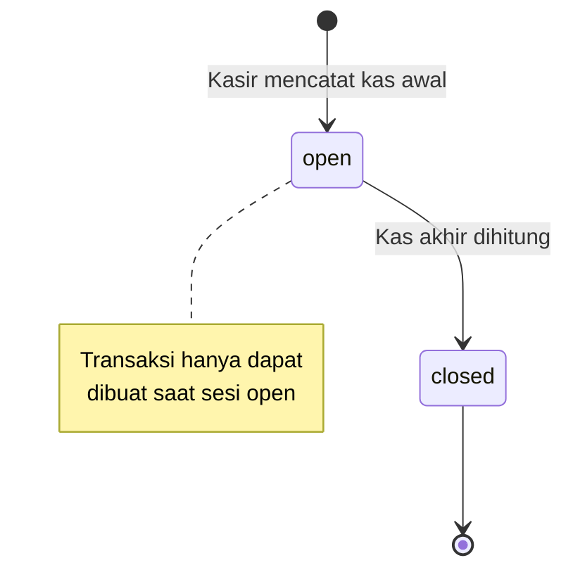
```mermaid
stateDiagram-v2
  [*] --> open : Kasir mencatat kas awal
  open --> closed : Kas akhir dihitung
  closed --> [*]

  note right of open
    Transaksi hanya dapat
    dibuat saat sesi open
  end note
```

### 6.4 Status event

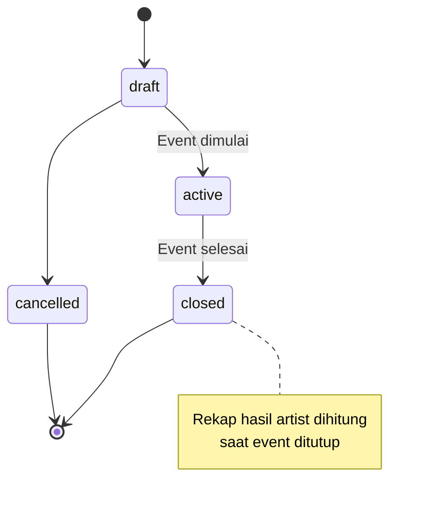
```mermaid
stateDiagram-v2
  [*] --> draft
  draft --> active : Event dimulai
  draft --> cancelled
  active --> closed : Event selesai
  closed --> [*]
  cancelled --> [*]

  note right of closed
    Rekap hasil artist dihitung
    saat event ditutup
  end note
```

### 6.5 Status pengiriman

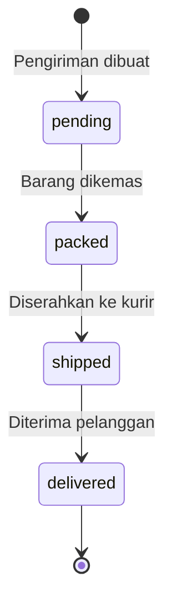
```mermaid
stateDiagram-v2
  [*] --> pending : Pengiriman dibuat
  pending --> packed : Barang dikemas
  packed --> shipped : Diserahkan ke kurir
  shipped --> delivered : Diterima pelanggan
  delivered --> [*]
```

---

## 7. Deployment diagram

Seluruh komponen berjalan di satu laptop operasional.

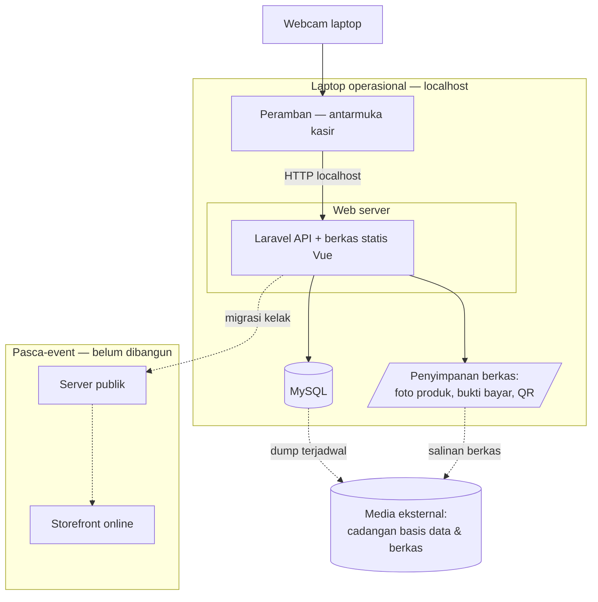
```mermaid
flowchart TB
  subgraph LAPTOP[Laptop operasional — localhost]
    subgraph WEB[Web server]
      LAR[Laravel API + berkas statis Vue]
    end
    DB[(MySQL)]
    FS[/Penyimpanan berkas:<br/>foto produk, bukti bayar, QR/]
    BR[Peramban — antarmuka kasir]
  end

  CAM[Webcam laptop]
  EXT[(Media eksternal:<br/>cadangan basis data & berkas)]

  BR -->|HTTP localhost| LAR
  LAR --> DB
  LAR --> FS
  CAM --> BR
  DB -.dump terjadwal.-> EXT
  FS -.salinan berkas.-> EXT

  subgraph FUTURE[Pasca-event — belum dibangun]
    SRV[Server publik]
    SHOP[Storefront online]
  end

  LAR -.migrasi kelak.-> SRV
  SRV -.-> SHOP
```

Tidak ada panah keluar ke internet pada blok utama. Inilah alasan kebutuhan offline terpenuhi tanpa lapisan sinkronisasi.

Panah putus-putus ke media eksternal adalah satu-satunya pengaman terhadap kerusakan perangkat. Bila panah itu tidak dijalankan rutin, seluruh data penjualan bergantung pada satu laptop.

---

## 8. Catatan implementasi

| Aturan | Alasan |
|---|---|
| Transaksi penjualan, pembayaran, bukti, dan pergerakan stok ditulis dalam satu transaksi database | Mencegah stok berkurang tanpa transaksi tercatat, atau sebaliknya |
| Validasi bukti bayar wajib ditegakkan di sisi server | Aturan di antarmuka saja dapat dilewati melalui permintaan API langsung |
| `stock_movements` bersifat append-only | Koreksi dilakukan dengan baris `adjustment` baru, bukan mengubah riwayat |
| Nomor transaksi dan pre-order dihasilkan server | Menghindari duplikasi bila antarmuka mengirim ulang permintaan |
| Status hanya berpindah sesuai state machine di bagian 6 | Lompatan status seperti `ordered` langsung ke `handed_over` harus ditolak API |

---

## 9. Gate lisensi Pro vs Master (v1.1)

Ditambahkan setelah keputusan produk: multi-artist tetap ada tapi bisa
dimatikan, dengan harga berbeda per tingkat. Bukan diagram baru — cukup
satu titik keputusan yang menyisip ke use case `uc1` (Kelola artist) di
bagian 1.

```mermaid
flowchart TD
  A([Admin klik "Tambah Artist"]) --> B{multi_artist_enabled?}
  B -->|Ya - Master| C[Buat artist baru, tanpa batas]
  B -->|Tidak - Pro| D{Sudah ada artist aktif?}
  D -->|Belum, instalasi baru| E[Buat sebagai artist bawaan]
  D -->|Sudah ada| F[Tolak 403: perlu upgrade ke Master]
```

Titik penegakan: `ArtistPolicy::create`, bukan di layer database. Skema
tidak berubah — `artists` tetap tabel biasa tanpa kolom atau constraint
tambahan untuk membedakan Pro/Master.

Konsekuensi pada diagram lain di dokumen ini: relasi `Artist → Product`
pada class diagram (bagian 2) dan snapshot `artist_id` di `OrderItem`
tetap sama persis untuk kedua tingkat harga — pada Pro, seluruh
`order_items` hanya menunjuk ke satu artist bawaan itu. Tidak ada
percabangan skema antara Pro dan Master, hanya percabangan di titik
pembuatan artist.

### 9.1 Jalur upgrade Pro → Master kini lewat endpoint sungguhan (v1.3)

Sebelumnya bagian ini tidak menyebut BAGAIMANA `multi_artist_enabled`
sungguhan diubah di instalasi nyata — satu-satunya cara yang ada adalah
`Setting::updateOrCreate()` dipanggil manual lewat `php artisan tinker`.
`PUT /settings` (F14.1/F14.3) sekarang menjadi jalur admin resmi, dengan
efek samping yang tidak boleh dilewatkan: setiap key yang berubah (termasuk
`multi_artist_enabled`) menulis satu baris `ActivityLog` di transaksi yang
sama.

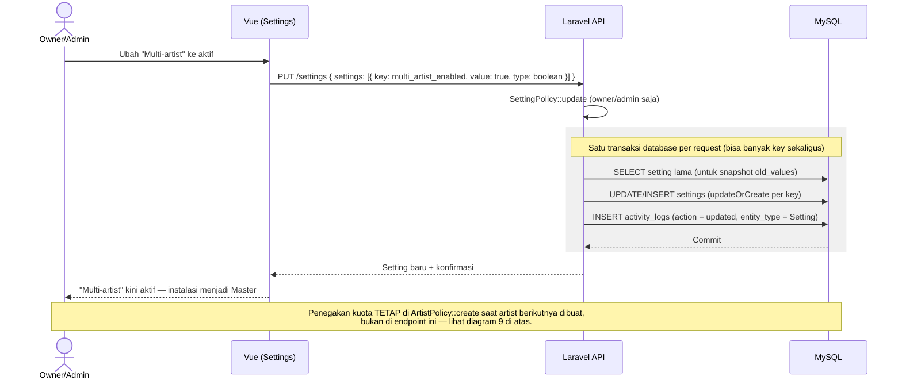
```mermaid
sequenceDiagram
  actor A as Owner/Admin
  participant UI as Vue (Settings)
  participant API as Laravel API
  participant DB as MySQL

  A->>UI: Ubah "Multi-artist" ke aktif
  UI->>API: PUT /settings { settings: [{ key: multi_artist_enabled, value: true, type: boolean }] }
  API->>API: SettingPolicy::update (owner/admin saja)
  rect rgba(128,128,128,0.12)
    note over API,DB: Satu transaksi database per request (bisa banyak key sekaligus)
    API->>DB: SELECT setting lama (untuk snapshot old_values)
    API->>DB: UPDATE/INSERT settings (updateOrCreate per key)
    API->>DB: INSERT activity_logs (action = updated, entity_type = Setting)
    DB-->>API: Commit
  end
  API-->>UI: Setting baru + konfirmasi
  UI-->>A: "Multi-artist" kini aktif — instalasi menjadi Master

  note over A,DB: Penegakan kuota TETAP di ArtistPolicy::create saat artist berikutnya dibuat,<br/>bukan di endpoint ini — lihat diagram 9 di atas.
```

`GET /settings` (daftar lengkap, owner/admin) dan `GET /settings/features`
(ringkasan kosmetik untuk UI, tidak dibatasi peran secara ketat karena
bukan sumber otorisasi) melengkapi sisi baca. `payment_channels` sengaja
tidak ikut di `GET /settings` — itu resource terpisah dengan penyamaran
nomor rekeningnya sendiri (lihat bagian 13).

---

## 10. Log aktivitas (F13.4) — pasca-MVP, ditambahkan sesi ini

Ditambahkan supaya tindakan sensitif (hapus data, penyesuaian stok,
perubahan harga/pengaturan) punya jejak audit yang bisa ditinjau lewat
`GET /activity-logs` (owner/admin saja), bukan cuma tersirat dari state
akhir tabel.

### 10.1 Aturan penulisan

`ActivityLogger::log()` SELALU dipanggil di DALAM `DB::transaction()` yang
sama dengan mutasi yang dicatatnya — kalau mutasinya rollback, baris log
ikut rollback. Tidak pernah ada log yang mengklaim sebuah hapus/perubahan
terjadi padahal transaksinya batal.

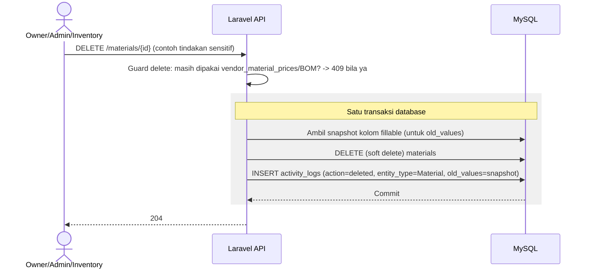
```mermaid
sequenceDiagram
  actor A as Owner/Admin/Inventory
  participant API as Laravel API
  participant DB as MySQL

  A->>API: DELETE /materials/{id}  (contoh tindakan sensitif)
  API->>API: Guard delete: masih dipakai vendor_material_prices/BOM? -> 409 bila ya
  rect rgba(128,128,128,0.12)
    note over API,DB: Satu transaksi database
    API->>DB: Ambil snapshot kolom fillable (untuk old_values)
    API->>DB: DELETE (soft delete) materials
    API->>DB: INSERT activity_logs (action=deleted, entity_type=Material, old_values=snapshot)
    DB-->>API: Commit
  end
  API-->>A: 204
```

Titik-titik lain yang menulis log dengan pola identik: create/update/delete
pada `Artist`, `Category`, `Product` (termasuk `price_changed` saat
`cost_price`/`sell_price` berubah lewat `PUT /variants/{id}`),
`POST /stock/adjustments` (`stock_adjusted`), `POST /orders/{id}/void`,
`PUT /settings`, dan create/delete pada `Vendor`/`Material`/baris BOM.
`action` selalu satu dari: `created`, `updated`, `deleted`,
`stock_adjusted`, `price_changed`, `imported` (dipakai impor Excel massal,
bagian 11).

### 10.2 Bentuk pembacaan

`old_values`/`new_values` adalah SNAPSHOT kolom fillable entitas pada saat
kejadian (`$model->only($model->getFillable())`), bukan diff per-field —
`GET /activity-logs` mengembalikan keduanya apa adanya dan UI yang
membandingkan bila perlu ditampilkan sebagai diff. Filter yang didukung:
`entity_type`, `entity_id`, `user_id`, `action`, rentang tanggal.

---

## 11. Impor/ekspor Excel master data (PRD 7.15) — pasca-MVP, diaktifkan kembali 2026-09-01

Dicoret dari cakupan MVP awal (PRD §10.2), lalu diaktifkan kembali atas
permintaan eksplisit pemilik produk. Cakupan: satu workbook `.xlsx`
berisi sampai **delapan sheet** — `artists`, `categories`, `products`,
`stock` (F15 asli) ditambah `vendors`, `materials`, `vendor_prices`,
`bom` (menyusul modul Vendor/Bahan Baku/BOM, bagian 12).

### 11.1 Urutan pemrosesan dan pola semua-atau-tidak-sama-sekali

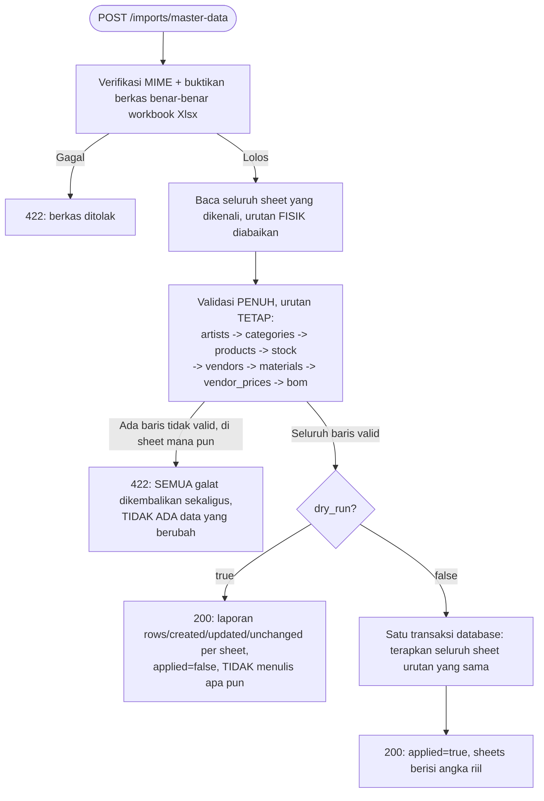
```mermaid
flowchart TD
  A([POST /imports/master-data]) --> B[Verifikasi MIME + buktikan berkas benar-benar workbook Xlsx]
  B -->|Gagal| Z1[422: berkas ditolak]
  B -->|Lolos| C[Baca seluruh sheet yang dikenali, urutan FISIK diabaikan]
  C --> D["Validasi PENUH, urutan TETAP:\nartists -> categories -> products -> stock\n-> vendors -> materials -> vendor_prices -> bom"]
  D -->|Ada baris tidak valid, di sheet mana pun| Z2[422: SEMUA galat dikembalikan sekaligus,\nTIDAK ADA data yang berubah]
  D -->|Seluruh baris valid| E{dry_run?}
  E -->|true| F[200: laporan rows/created/updated/unchanged per sheet,\napplied=false, TIDAK menulis apa pun]
  E -->|false| G[Satu transaksi database: terapkan seluruh sheet urutan yang sama]
  G --> H[200: applied=true, sheets berisi angka riil]
```

Menyimpang SENGAJA dari kriteria penerimaan F15.5 asli ("simpan 97 baris
valid, laporkan yang gagal") — sheet-sheet ini saling bergantung
(`products` mereferensikan `artists`/`categories`; `stock` dan `bom` boleh
menunjuk SKU yang baru dibuat sheet `products` pada berkas yang sama),
sehingga penyimpanan sebagian akan meninggalkan master data setengah jadi
yang lebih sulit dibereskan daripada mengulang satu berkas yang sudah
diperbaiki. Alasan lengkap ada di dokblok `MasterDataImportService`.

### 11.2 Resolusi SKU tertunda (deferred resolution)

`stock` dan `bom` boleh menunjuk `sku` yang BARU AKAN dibuat oleh sheet
`products` pada berkas yang sama, karena SKU sebenarnya deterministik
(`code_prefix` + urutan 4 digit) — resolusinya sengaja ditunda sampai
sheet `products` diterapkan, baru kemudian `stock`/`bom` dicocokkan. SKU
yang tetap tidak ditemukan setelah itu adalah galat per-baris biasa yang
membatalkan seluruh impor (pola 11.1 di atas), bukan kasus khusus.

### 11.3 Gambar via nama berkas (Task 6)

Sheet `products` dan `categories` punya kolom `image_filename`. Nilainya
dicocokkan terhadap nama ASLI salah satu berkas yang diunggah bersamaan
lewat field `images[]` pada request multipart yang sama (bukan lewat
kolom terpisah per baris, dan bukan lewat path/URL).

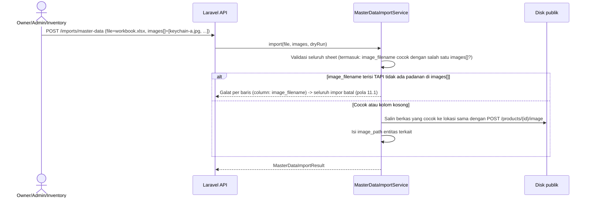
```mermaid
sequenceDiagram
  actor A as Owner/Admin/Inventory
  participant API as Laravel API
  participant SVC as MasterDataImportService
  participant DISK as Disk publik

  A->>API: POST /imports/master-data (file=workbook.xlsx, images[]=[keychain-a.jpg, ...])
  API->>SVC: import(file, images, dryRun)
  SVC->>SVC: Validasi seluruh sheet (termasuk: image_filename cocok dengan salah satu images[]?)
  alt image_filename terisi TAPI tidak ada padanan di images[]
    SVC-->>API: Galat per baris (column: image_filename) -> seluruh impor batal (pola 11.1)
  else Cocok atau kolom kosong
    SVC->>DISK: Salin berkas yang cocok ke lokasi sama dengan POST /products/{id}/image
    SVC->>SVC: Isi image_path entitas terkait
  end
  SVC-->>API: MasterDataImportResult
```

Kolom `image_filename` kosong berarti "tidak ada gambar diikutsertakan"
(gambar lama, bila ada, tidak diubah) — bukan "hapus gambar". Ini
konsisten dengan aturan umum "sel kosong = jangan diubah" pada seluruh
impor ini.

### 11.4 Ekspor

`GET /exports/{entity}` (satu entitas, satu sheet) dan
`GET /imports/master-data/template` (kedelapan sheet sekaligus, dengan
satu baris contoh) memakai kamus judul kolom yang sama persis
(`App\Support\MasterDataSheets`) dengan yang dibaca `POST
/imports/master-data` — sehingga berkas hasil ekspor bisa disunting lalu
diunggah kembali apa adanya, tanpa transformasi manual.

---

## 12. Vendor, Bahan Baku, dan BOM — pasca-MVP, ditambahkan 2026-09-01

**Bukan kebangkitan** butir "vendor management"/"materials & production"
yang dicoret PRD §10.2 — cakupan di sini sengaja lebih sempit: tidak ada
purchase order ke vendor, tidak ada penjadwalan produksi. Modul ini murni
mencatat siapa menjual bahan apa dengan harga berapa, dan berapa modal
bahan (`bom_cost`) satu varian produk berdasarkan resep (BOM)-nya.

### 12.1 Mengapa BOM diikat ke varian, bukan produk

`ProductVariantBomLine` menunjuk `product_variant_id`, bukan `product_id`
— varian ukuran/warna berbeda dari produk yang sama (mis. keychain 3 cm
vs 5 cm) bisa butuh jumlah bahan berbeda, dan `ProductVariant` sudah jadi
entitas kelas satu untuk data per-SKU lain (`sell_price`, `cost_price`,
`current_stock`) di seluruh basis kode ini.

### 12.2 Pemilihan harga vendor saat >1 vendor menjual bahan yang sama

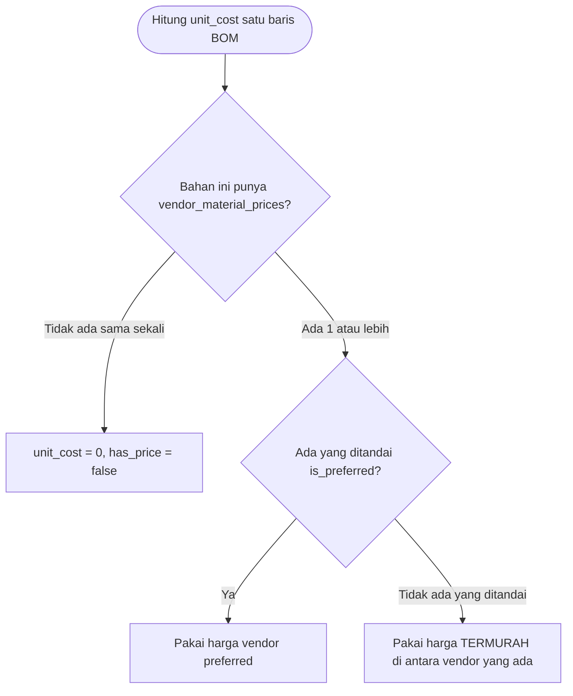
```mermaid
flowchart TD
  A([Hitung unit_cost satu baris BOM]) --> B{Bahan ini punya vendor_material_prices?}
  B -->|Tidak ada sama sekali| C[unit_cost = 0, has_price = false]
  B -->|Ada 1 atau lebih| D{Ada yang ditandai is_preferred?}
  D -->|Ya| E[Pakai harga vendor preferred]
  D -->|Tidak ada yang ditandai| F[Pakai harga TERMURAH di antara vendor yang ada]
```

Menandai `is_preferred = true` pada satu harga vendor OTOMATIS melepas
tanda itu dari harga vendor lain milik bahan yang sama (ditegakkan di
`MaterialController`, bukan constraint database — "preferred" adalah
pilihan bisnis yang bisa berubah kapan saja, bukan invariant struktural).
Fallback ke harga termurah adalah default defensif/optimistis untuk
estimasi biaya, BUKAN rekomendasi pembelian — didokumentasikan di
`BomCostCalculator`/`Material::referencePrice()`.

### 12.3 `bom_cost` tidak pernah menimpa `cost_price`

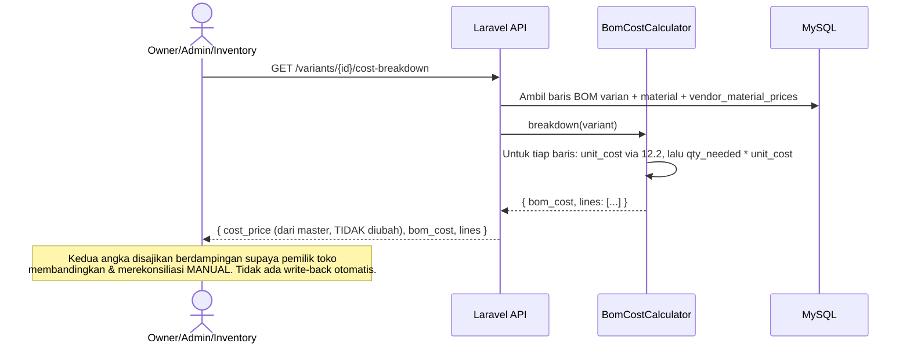
```mermaid
sequenceDiagram
  actor A as Owner/Admin/Inventory
  participant API as Laravel API
  participant CALC as BomCostCalculator
  participant DB as MySQL

  A->>API: GET /variants/{id}/cost-breakdown
  API->>DB: Ambil baris BOM varian + material + vendor_material_prices
  API->>CALC: breakdown(variant)
  CALC->>CALC: Untuk tiap baris: unit_cost via 12.2, lalu qty_needed * unit_cost
  CALC-->>API: { bom_cost, lines: [...] }
  API-->>A: { cost_price (dari master, TIDAK diubah), bom_cost, lines }
  note over A: Kedua angka disajikan berdampingan supaya pemilik toko<br/>membandingkan & merekonsiliasi MANUAL. Tidak ada write-back otomatis.
```

`cost_price` sudah dipakai di seluruh basis kode ini untuk laporan
profit (bagian 8) dan rekap artist (F9.1/F11) — menimpanya otomatis dari
`bom_cost` adalah risiko korektnes terhadap kode yang sudah teruji di
tempat lain, sehingga sengaja tidak dilakukan. Lihat dokblok
`App\Services\BomCostCalculator` untuk rasional lengkap.

### 12.4 Guard hapus

Mengikuti pola `Artist`/`Category`: `Vendor` yang masih punya baris
`vendor_material_prices` dan `Material` yang masih punya baris
`vendor_material_prices` ATAU baris BOM varian mana pun, ditolak hapus
dengan 409 — mencegah baris yatim yang diam-diam mengubah `bom_cost`
varian lain tanpa jejak.

---

## 13. Kanal pembayaran QR — unggah/render saat checkout (v1.3)

Diagram sequence kasir pada bagian 3 sudah menunjukkan kasir memanggil
`GET /payment-channels`, tapi belum menunjukkan alur unggah gambar QR
maupun bug yang sempat membuat kasir tidak bisa menampilkan channel sama
sekali.

### 13.1 Kelola kanal (owner/admin)

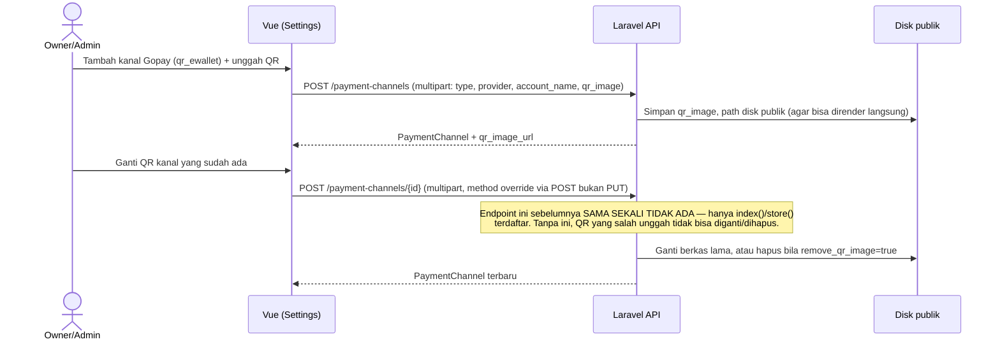
```mermaid
sequenceDiagram
  actor A as Owner/Admin
  participant UI as Vue (Settings)
  participant API as Laravel API
  participant DISK as Disk publik

  A->>UI: Tambah kanal Gopay (qr_ewallet) + unggah QR
  UI->>API: POST /payment-channels (multipart: type, provider, account_name, qr_image)
  API->>DISK: Simpan qr_image, path disk publik (agar bisa dirender langsung)
  API-->>UI: PaymentChannel + qr_image_url

  A->>UI: Ganti QR kanal yang sudah ada
  UI->>API: POST /payment-channels/{id} (multipart, method override via POST bukan PUT)
  note over API: Endpoint ini sebelumnya SAMA SEKALI TIDAK ADA — hanya index()/store()<br/>terdaftar. Tanpa ini, QR yang salah unggah tidak bisa diganti/dihapus.
  API->>DISK: Ganti berkas lama, atau hapus bila remove_qr_image=true
  API-->>UI: PaymentChannel terbaru
```

### 13.2 Bug yang diperbaiki — render QR & auto-pilih channel tunggal

Dua bug terpisah, sama-sama menyebabkan checkout non-tunai tampak buntu
di layar kasir:

1. **Backend — `route('payment-channels.qr', ...)` tidak pernah
   didefinisikan.** `PaymentChannelController::index()` sebelumnya
   memanggil nama route yang tidak ada di `routes/api.php`; begitu ada
   SATU kanal dengan `qr_image_path` terisi, `GET /payment-channels`
   melempar `RouteNotFoundException` (500) untuk SEMUA kanal, bukan
   sekadar `qr_image_url` kosong pada satu baris. Diperbaiki dengan
   membentuk URL langsung dari disk publik (`ImageUploadService::url()`),
   konsisten dengan bagaimana gambar produk/kategori dirender.
2. **Frontend — `ChannelPicker.vue` tidak auto-pilih saat hanya ada satu
   kanal.** Chip pemilihan hanya dirender ketika `channels.length > 1`,
   tanpa fallback, sehingga saat toko hanya punya satu kanal (mis. satu
   Gopay) tidak ada yang pernah otomatis terpilih — layar checkout QRIS
   menampilkan "Pilih kanal pembayaran di atas." selamanya. Diperbaiki
   dengan `watch` yang otomatis meng-emit satu-satunya kanal saat daftar
   berisi tepat satu item; perilaku pilih-manual untuk 2+ kanal tidak
   berubah.

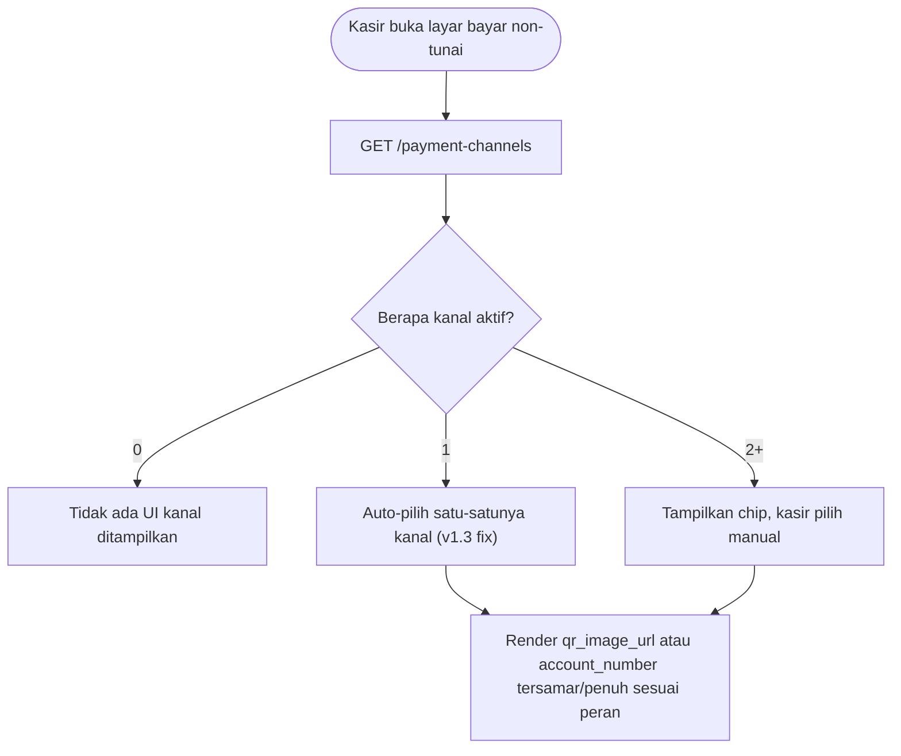
```mermaid
flowchart TD
  A([Kasir buka layar bayar non-tunai]) --> B[GET /payment-channels]
  B --> C{Berapa kanal aktif?}
  C -->|0| D["Tidak ada UI kanal ditampilkan"]
  C -->|1| E["Auto-pilih satu-satunya kanal (v1.3 fix)"]
  C -->|2+| F[Tampilkan chip, kasir pilih manual]
  E --> G[Render qr_image_url atau account_number tersamar/penuh sesuai peran]
  F --> G
```

## 14. Manajemen pengguna & peran kustom, profil toko — pasca-MVP, ditambahkan 2026-09-02

Fitur `001-user-store-settings`. Mengganti seluruh model otorisasi berbasis
enum `role` 4-nilai tetap (owner/admin/kasir/manajer inventori) dengan model
`Role` dinamis ber-`menu_keys`, dan melengkapi identitas toko di struk.
Bukan perluasan kecil dari bagian 9 (gate lisensi Pro/Master) — itu tetap
memakai `LicenseGate`/`multi_artist_enabled` tanpa perubahan; ini adalah
lapisan otorisasi terpisah yang menentukan menu mana yang boleh diakses tiap
pengguna.

### 14.1 Migrasi dua tahap skema (pola yang sama dengan `payments.preorder_id`)

```mermaid
flowchart LR
  A["users.role (enum lama)"] -->|migrasi 1: tambah role_id nullable + seed 4 peran default + backfill| B["users.role DAN role_id (dua-duanya ada)"]
  B -->|migrasi 2 (tanggal belakangan): role_id NOT NULL, drop kolom role| C["users.role_id (satu-satunya sumber peran)"]
```

Empat peran default yang di-seed pada migrasi pertama mereplikasi PERSIS hak
akses lama sebelum kolom `role` dihapus: Owner dan Admin mendapat
`MenuKeys::keys()` (semua menu), Kasir mendapat
`dashboard, pos, session, events, customers, preorders, sales`, dan
Inventory mendapat set Kasir ditambah
`products, artists, categories, stock, vendors, materials`. Ini diverifikasi
lewat login sungguhan sebagai 4 akun (bukan hanya lewat test) sebelum
migrasi tahap dua dijalankan.

### 14.2 Primitif otorisasi tunggal

```mermaid
classDiagram
  class User {
    +role_id
    +photo_path
    +last_access_at
    +canAccessMenu(menuKey) bool
  }
  class Role {
    +menu_keys: json
    +canAccessAnyOf(keys) bool
  }
  User "1..*" --> "1" Role
```

`User::canAccessMenu('users')` menggantikan ~15 titik pemeriksaan lama
(`isOwnerOrAdmin()` inline di 6 controller, `canManageMasterData()` di 17
`FormRequest`, dan beberapa policy) — satu primitif, bukan tiga mekanisme
paralel seperti sebelumnya. `App\Support\MenuKeys` adalah satu-satunya
sumber daftar menu, dipakai backend (validasi) dan frontend
(`GET /menu-keys` mengisi `RoleMenuPicker.vue`).

**Guard kunci-diri (self-lockout), diberi status 409 bukan 403** — karena ini
konflik aturan bisnis ("akun ini akan terkunci"), bukan penolakan izin:
seorang pengguna tidak bisa menonaktifkan/menghapus/mengubah peran akunnya
sendiri yang sedang login (`UserPolicy`), dan sebuah peran tidak bisa
dihapus/diedit sehingga menyisakan nol peran yang masih bisa kelola menu
`users`+`roles` (`RolePolicy::wouldLeaveNoRoleCapableOfManagingAccess()`),
maupun dihapus selagi masih punya pengguna (`user_count > 0`).

### 14.3 Profil toko di struk

`Setting` (tabel key-value generik yang sama dipakai gate lisensi) diberi
lima key baru: `store_address`, `store_logo_path`, `store_contact_person`,
`store_contact_phone`, `store_contact_email` — bukan tabel baru, karena
profil toko adalah satu baris data tunggal per instalasi, pola yang sama
dengan pertimbangan di catatan `Setting` pada bagian 2. Celah yang ditemukan
saat implementasi: `GET /orders/{id}/receipt` sebelumnya hanya menampilkan
`store_name`/`store_contact` lama, padahal spec mewajibkan identitas toko
lengkap tercantum di struk — diperbaiki dengan menambah lima field di atas
ke response `receipt()`, memakai `ImageUploadService::url()` untuk logo
(pola sama dengan bagian 13), dan field yang belum diisi tampil `null`
(dihilangkan gracefully di `ReceiptModal.vue`), bukan string kosong.

### 14.4 Ekspor/impor Excel diperluas 8 → 10 sheet

`roles` dan `users` ditambahkan ke urutan pemrosesan
(`artists → categories → products → stock → vendors → materials →
vendor_prices → bom → roles → users`) mengikuti pola bagian 11, dengan satu
penyimpangan yang disengaja: sheet baru merujuk relasinya lewat NAMA, bukan
`code`, karena `Role` tidak punya kolom kode. Pengguna baru yang dibuat
lewat impor mendapat `Hash::make(Str::random(32))` — tidak pernah password
yang dikirim klien.
